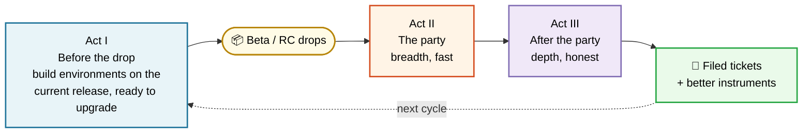
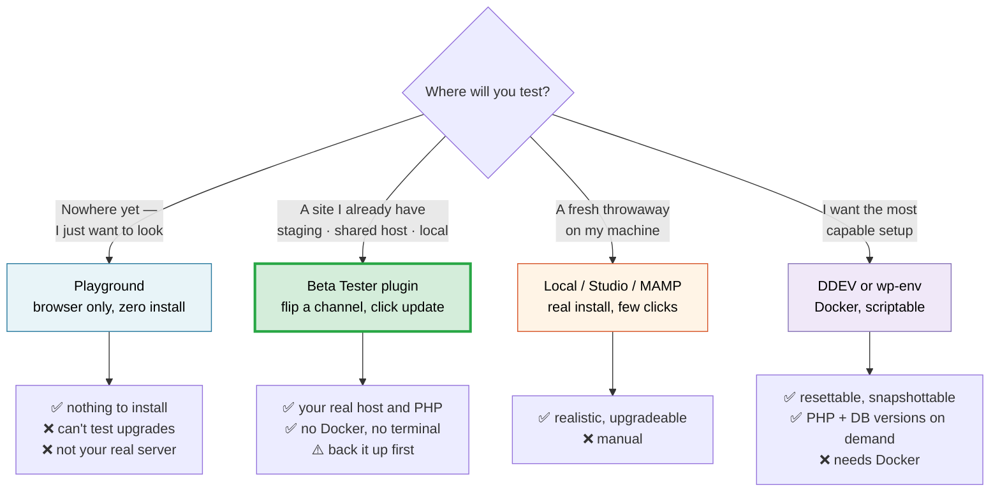
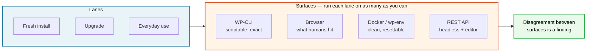

# Testing WordPress releases

*How to test a WordPress Beta or RC so that your "it works!" means something, and your "it's
broken!" gets fixed.*

[](LICENSE)
[](https://make.wordpress.org/test/)
[](CONTRIBUTING.md)

Anyone can install a Beta or RC, click around, and report "seems fine." That takes an hour
and helps approximately no one. This is the other thing — testing where a pass is evidence and a
failure is actionable.



## The 30-second start

**Don't want to read any of this?** Copy the block below into ChatGPT, Claude, Gemini, Copilot —
anything that can fetch a URL. It sets up the whole project and walks you through it.

```
Set me up to test WordPress releases using this project:
https://github.com/courtneyr-dev/wp-release-audit-method

Read these four files first:
- https://raw.githubusercontent.com/courtneyr-dev/wp-release-audit-method/main/README.md
- https://raw.githubusercontent.com/courtneyr-dev/wp-release-audit-method/main/sources/official-sources.md
- https://raw.githubusercontent.com/courtneyr-dev/wp-release-audit-method/main/playbooks/release-day-sweep-playbook.md
- https://raw.githubusercontent.com/courtneyr-dev/wp-release-audit-method/main/playbooks/slack-test-report-template.md

Then:
1. Ask me what I've got — my OS, whether I have Docker, and whether I have a site
   I can safely break. Recommend ONE setup path; don't list all four.
2. Walk me through that path one step at a time. Wait for me after each step.
3. Use ONLY the official sources register above for any factual claim about
   WordPress. If you can't source a claim there, say so instead of guessing.
4. When I have results, help me write them up — and tell me plainly which of my
   claims my evidence doesn't actually support.

I'm comfortable in a terminal but I'm not a WordPress developer.
```

Adjust that last line to describe yourself and the assistant will pitch it right. If you have shell
access (Claude Code, Cursor, Copilot CLI), add: *"clone the repo and run the scripts for me."*

> [!TIP]
> Point 4 is the one that matters. Assistants agree with you by default and will happily promote
> "seemed broken" into "confirmed bug." Asking to be contradicted is most of what this project is
> about.

## Who this is for

You run WordPress sites. You can follow instructions in a terminal. You've offered to help
test a Beta or RC — or you'd like to, and you're not sure what "helping" actually looks like.

You are **not** expected to read WordPress core code, write PHP, or know what a changeset is.

> [!NOTE]
> If you've ever thought *"I tested the Beta or RC and it seemed fine, but I don't think that
> helped anyone"* — you were probably right, and this is the fix.

> [!TIP]
> **Ship a plugin or theme?** Go to [`plugin-theme-authors/`](plugin-theme-authors/) instead — the same method
> narrowed to your own code, plus what to verify before you bump **"Tested up to"** and what the
> plugin directory expects.

## Contents

| | |
|---|---|
| **Plugin/theme authors** | [Testing your own plugin or theme](plugin-theme-authors/) — including the ["Tested up to" bump](plugin-theme-authors/#the-tested-up-to-bump) |
| **Get going** | [Before you start](#before-you-start) · [Check the build](#step-1-check-the-build-60-seconds) · [Get a test site](#step-2-get-a-test-site) · [The debugging toolkit](#the-debugging-toolkit-works-with-any-option) · [Run the suites](#step-3-run-the-test-suites) · [Preflight](#step-4-check-what-your-setup-can-detect) |
| **The main event** | [A release party in three acts](#a-release-party-in-three-acts) |
| **Accessibility** | [Baked in throughout](accessibility/) — automated, keyboard, screen reader, and the calibration rule |
| **Internationalization** | [i18n and RTL](i18n/) — ~200 locales, and the class of bug English-only testing cannot see |
| **Get it right** | [Five ways your test can lie to you](#five-ways-your-test-can-lie-to-you) · [How to report](#how-to-report-what-you-find) · [Official sources](#where-official-information-lives) |
| **Tooling** | [AI assistants](#using-ai-assistants) · [Tools and integrations](#tools-and-integrations) |
| **Reference** | [What's in here](#whats-in-this-repository) · [Safety](#safety-and-scope) · [Known gaps](#known-gaps) |

---

## Before you start

**You need:**

- A terminal (Mac, Linux, or Windows with WSL)
- The beta or RC `.zip` from [wordpress.org/download/releases](https://wordpress.org/download/releases/)

**You'll want soon, but not yet:**

- A local WordPress setup — [three options below](#step-2-get-a-test-site)
- A [WordPress.org account](https://login.wordpress.org/register), for reporting
- [Making WordPress Slack](https://make.wordpress.org/chat/), where testing is coordinated

**Grab this guide and its scripts:**

```bash
git clone https://github.com/courtneyr-dev/wp-release-audit-method.git
cd wp-release-audit-method
```

> [!IMPORTANT]
> **Read [`sources/official-sources.md`](sources/official-sources.md) before you start** — or
> point your AI assistant at it.
>
> It's the register of what's authoritative for each kind of WordPress question, and loading it
> **constrains the whole project to official sources only.** WordPress.org, Make blogs, Trac,
> Developer Resources, and the running build itself. Two supplementary publications are
> allowlisted for discovery, and everything else — random blogs, Stack Overflow, search
> snippets, and an AI's own memory — is out of scope for factual claims.
>
> That constraint is what makes a report trustworthy. Most weak bug reports aren't wrong about
> the symptom; they're wrong about what was *supposed* to happen, because somebody read a
> four-month-old planning post and assumed it shipped.

---

## Step 1: Check the build (60 seconds)

Do this first. No WordPress install, no Docker, no database. Just the zip you downloaded.

```bash
bash scripts/fast-triage.sh ~/Downloads/wordpress-7.2-beta1.zip
```

```
════ BUILD IDENTITY
  $wp_version = '7.2-beta1'
  $wp_db_version = 61840
  sha256: 4f3a...

════ FILES REMOVED BUT NOT DECLARED IN $_old_files
  wp-includes/images/icon-library/  (243 files)
```

**That second section is the money.** WordPress keeps an internal list of files it should
delete during an upgrade (`$_old_files`). When files get removed from the codebase but
nobody adds them to that list, upgrading sites *keep the old files forever*.

During WordPress 7.1 testing this found **243 leftover files**. A fresh install can never
show you this, because a fresh install has no old files to leave behind.

**Comparing two builds is even better:**

```bash
bash scripts/fast-triage.sh ~/Downloads/wordpress-7.2-RC1.zip ~/Downloads/wordpress-7.2-beta4.zip
```

> [!TIP]
> Run this the minute a build drops. It costs one minute and tells you where the next hour
> is best spent.

---

## Step 2: Get a test site

> [!CAUTION]
> **Never test a Beta or RC on a real site.** Not "a small one." Not "just to look."
> Prereleases eat databases.



> [!TIP]
> **The scripts run on all of these**, not just wp-env — pass `--env=`. See
> [what each one can and can't detect](#which-setup-can-detect-what) below before you
> pick, because that difference decides which findings are even reachable for you.

### Option A — the Beta Tester plugin *(how most people do it)*

The [**WordPress Beta Tester**](https://wordpress.org/plugins/wordpress-beta-tester/) plugin
puts a Beta or RC on a site you already have. Staging site at your host, a subdomain on
shared hosting, a local install — anywhere you can install a plugin. No Docker, no terminal,
no Node.

It's maintained by Andy Fragen, Colin Stewart, Paul Biron, Maura Teal, and Peter
Westwood ([GitHub](https://github.com/afragen/wordpress-beta-tester)), and it's the path the
Test team assumes in most [calls for testing](https://make.wordpress.org/test/).

**Setup:**

1. Install and activate **WordPress Beta Tester**
2. Go to **Tools → Beta Testing** (**Settings → Beta Testing** on multisite)
3. Pick your **channel**:
   - **Point release** *(default)* — the next minor, e.g. 7.1.1. Lower risk.
   - **Bleeding edge** — trunk, where the next major is being built.
4. Pick your **stream**:
   - **Beta/RC only** — betas and release candidates. **Start here.**
   - **Nightlies** — rebuilt daily from trunk. Genuinely unstable; expect breakage.
5. Go to **Dashboard → Updates** and update.

> [!CAUTION]
> **Back up first, and don't do this on a site that matters.** The plugin's own advice is
> "don't forget to backup before you start" — take it literally. There's no supported
> downgrade path from a Beta or RC; going back means restoring your backup.
>
> A staging copy of a real site is ideal, because your plugins, theme, and content are the
> thing most likely to expose a regression that a clean install never will.

**Two extra settings** worth knowing: *Skip successful autoupdate emails* (stops the inbox
flood on nightlies) and *Skip bundled plugins and themes* (keeps core updates from
reinstalling Twenty-Whatever every time).

> [!TIP]
> Beta Tester uses **WordPress's own updater** — which is the lane most of your users are
> on, and the one that left [243 files behind](#five-ways-your-test-can-lie-to-you) in 7.1.
> That makes it a genuinely valuable lane to test, not a lesser one. Just name it in your
> report so nobody assumes you used WP-CLI.

### Option B — WordPress Playground *(fastest possible start)*

[WordPress Playground](https://wordpress.org/playground/) runs WordPress in your browser.
Nothing to install; throw it away by closing the tab.

**There's an official blueprint built for exactly this job:**

### ▶ [Launch a loaded Beta or RC test site](https://playground.wordpress.net/?blueprint-url=https://raw.githubusercontent.com/WordPress/blueprints/trunk/blueprints/beta-rc/blueprint.json)

One click gets you a running Beta or RC with everything already set up. The
[**beta-rc blueprint**](https://github.com/WordPress/blueprints/tree/trunk/blueprints/beta-rc)
lives in the official [WordPress blueprints collection](https://github.com/WordPress/blueprints)
and is maintained by this repo's author.

What you get, without configuring anything:

| | |
|---|---|
| **PHP 8.3**, WordPress **beta** channel | Falls back to stable outside a Beta/RC period |
| Logged in as admin | No setup screen |
| [a11y-theme-unit-test](https://github.com/wpaccessibility/a11y-theme-unit-test) | Accessibility test content |
| [theme-test-data](https://github.com/WordPress/theme-test-data) | The canonical content corpus — markup edge cases, nested menus, embeds, unicode, sticky and password-protected posts |
| [a11y-theme-unit-test](https://github.com/wpaccessibility/a11y-theme-unit-test) | Accessibility-focused test content |
| Six debugging plugins | [The toolkit below](#the-debugging-toolkit-works-with-any-option), preinstalled |

> [!NOTE]
> **Playground can't test upgrades**, and it tells you nothing about your real server's PHP
> or image libraries. It's excellent for "does this feature work and look right," useless for
> "will this break my site when I update." Use Option A for that.

More: [Playground docs](https://developer.wordpress.org/playground/) ·
[Make/Playground](https://make.wordpress.org/playground/) ·
[blueprint gallery](https://wordpress.github.io/blueprints/) ·
[another worked example](https://github.com/courtneyr-dev/WP7-testing)

### Option C — a local app

[Local](https://localwp.com/), [Studio](https://developer.wordpress.com/studio/), or
[MAMP](https://www.mamp.info/). A real install in a few clicks. Best for upgrade testing when
you want a *clean* starting point — install the previous version, add content, then upgrade.

Pairs well with Option A: install the previous release here, then use Beta Tester to make the
jump, and you've tested the exact path your users will take.

### Option D — wp-env

[`@wordpress/env`](https://developer.wordpress.org/block-editor/reference-guides/packages/packages-env/)
is WordPress's own Docker environment, and what the scripts here drive — it can reset a
database and switch versions on command.

Needs [Docker](https://www.docker.com/products/docker-desktop/) and
[Node.js](https://nodejs.org/):

```bash
npm install -g @wordpress/env
mkdir ~/wp-test && cd ~/wp-test
echo '{"core":"WordPress/WordPress#master"}' > .wp-env.json
wp-env start
```

It prints your URL (usually `http://localhost:8888`). Pass that directory to the scripts
below with `--env=wp-env`.

### Option E — DDEV *(the most capable, if you're willing to install it)*

[DDEV](https://ddev.com/) is a Docker environment widely used across the WordPress and
Drupal worlds. It costs one more install than wp-env and buys several things nothing else
here has: **database snapshots** (so an Act I fixture is restored in seconds instead of
rebuilt), **PHP and MariaDB/MySQL versions as one-line settings**, **trusted HTTPS**,
Apache *or* nginx, and wildcard hostnames — which are what make **subdomain** multisite
possible at all, since WP-CLI refuses to convert a `localhost:PORT` site.

```bash
mkdir ~/wp-test && cd ~/wp-test
mkdir .ddev && cp /path/to/this/repo/fixtures/ddev/config.yaml .ddev/config.yaml
ddev start
ddev wp core download --version=<the current stable, not the beta>
ddev wp core install --url='$DDEV_PRIMARY_URL' --title='audit fixture' \
  --admin_user=admin --admin_password=password --admin_email=a@example.com
```

Those single quotes around `$DDEV_PRIMARY_URL` are deliberate — it expands inside the
container. And note the **current stable**, not the beta: a site installed fresh on the
build you're testing cannot test an upgrade to it.

[`fixtures/ddev/config.yaml`](fixtures/ddev/config.yaml) is the point of this option.
Under wp-env a fixture is a paragraph of setup prose in your head; here it's a file you
can hand to someone else so they rebuild the same thing.

---

## Which setup can detect what

Every option above can run the suites — pass `--env=` and the scripts do the rest:

```bash
bash scripts/crud-suite.sh --env=ddev ~/wp-test
```

| Your setup | `--env=` | Needs | What it can't do |
|---|---|---|---|
| **DDEV** | `ddev` | Docker | nothing — it supports every capability |
| **wp-env** | `wp-env` | Docker + Node | no HTTPS |
| **Studio** | `studio` | the Studio app | no nginx/Apache (it runs PHP itself), no `db-reset`, SQLite by default |
| **Playground** | `playground` | Node 20+ | no shell, no HTTPS, no subdomain multisite, SQLite. The **only** one that takes `--wp=beta\|RC\|nightly` directly |
| **Local · MAMP · XAMPP · staging · a Beta Tester site** | `cli` | a WordPress that already exists | can't switch PHP, can't create or destroy the site |
| **Lando** | `lando` | Docker | unknown — **[not yet tested by anyone](#known-gaps)** |

That fifth row is the one that covers the most ground. `cli` is just WP-CLI pointed at an
install you already have, so [Option A](#option-a--the-beta-tester-plugin-how-most-people-do-it)
and [Option C](#option-c--a-local-app) finally get a scripted path — point it at
`~/Local Sites/<site>/app/public`, or at a `wp @staging` alias. It refuses to run until
you set `WP_AUDIT_CLI_DISPOSABLE=1`, because it's the only one that can be aimed at
something you'd miss.

They are **not** equivalent, and the differences decide which findings are reachable for
you rather than merely how convenient the setup is.

The clearest case is this repo's best-known finding. Catching 243 files left behind by an
upgrade needs three things at once: WordPress's **own** updater (WP-CLI's cleans them up
and says so), a **host-readable** copy of the files to diff, and a **real upgrade** from
an older install. A remote staging site has the first and third but not the second, so
the diff is simply impossible there. That's not a ranking — it's the reason your report
has to say which setup you used.

> [!TIP]
> Don't guess which of these your setup has, and don't trust folklore about it either.
> While this was being built, a confident and widely-repeated claim — that Playground
> can't reach WordPress's own updater — turned out to be false the first time anyone ran
> it. Ask your setup instead: `env_caps_report`, below.

Ask any setup what it can do:

```bash
. scripts/lib-env.sh
env_init ddev ~/wp-test
env_caps_report
```

```
════ ENVIRONMENT CAPABILITIES  (driver: ddev)
  has:    core-updater db-reset snapshot php-switch core-zip https xdebug shell …
  MISSING: sqlite apache mysql

  A cell needing any MISSING capability reports BLOCKED, not PASS.
```

**A cell that needs something your setup can't do reports `BLOCKED`, never `PASS`.** That
is the same rule as [Step 4](#step-4-check-what-your-setup-can-detect), applied to the
environment itself instead of to your zip library — and it's what stops "the suite passed"
from quietly meaning "the suite couldn't have failed."

Full details, and how to add a setup that isn't listed:
[`scripts/env/README.md`](scripts/env/README.md).

> [!TIP]
> **However you build environments, keep one you never rebuild.** Every option above starts
> clean, and clean state structurally cannot surface the dirty-state upgrade bugs real sites
> hit — orphaned options, half-migrated tables, residue from plugins deleted years ago. One
> designated site that only ever upgrades in place catches that whole class:
> [`method/standing-environment.md`](method/standing-environment.md).

---

## The debugging toolkit (works with any option)

Whichever environment you picked, these six plugins do most of the work of turning
*"something's wrong"* into *"here's what's wrong."* The
[beta-rc blueprint](#option-b--wordpress-playground-fastest-possible-start) installs all of
them; on a Beta Tester or local site, install them yourself.

| Plugin | What it gives you | Why it matters when testing a release |
|---|---|---|
| [**Query Monitor**](https://wordpress.org/plugins/query-monitor/) | Slow queries, PHP errors and notices, hooks fired, REST requests, capability checks, template used | **The one to install first.** Most "the page looks broken" reports are a PHP notice or a failed REST call that Query Monitor shows you in one glance. Turns a vague symptom into a specific line |
| [**Health Check & Troubleshooting**](https://wordpress.org/plugins/health-check/) | Server and config report, plus a troubleshooting mode that disables plugins and switches themes **for your session only** | Answers "is this WordPress, or is this my setup?" without taking the site down for anyone else. This is how you isolate a conflict on a staging site people are still looking at |
| [**Debug Bar**](https://wordpress.org/plugins/debug-bar/) | Core's own debug output in the toolbar — queries, cache, `WP_DEBUG` notices | Surfaces deprecation notices, which is exactly what a major release generates. Pairs with `WP_DEBUG` and `SCRIPT_DEBUG` in `wp-config.php` |
| [**User Switching**](https://wordpress.org/plugins/user-switching/) | Switch to any user in one click, and switch back | **Underrated for release testing.** A whole class of bug works fine for admins and breaks for Authors, Editors, or Contributors. Without this you're logging in and out all afternoon and will simply skip the check |
| [**Test Reports**](https://wordpress.org/plugins/test-reports/) | A formatted report with WordPress version, PHP, server, theme, plugins, and browser filled in | Gets the environment section of your bug report right automatically — the part people most often omit, and the first thing anyone triaging will ask for |
| [**Create Block Theme**](https://wordpress.org/plugins/create-block-theme/) | Build, modify, and export block themes | For testing theme-side and Site Editor changes, or producing a minimal theme that reproduces a problem |

On a scripted environment, one command installs all six **and** imports the same two content
corpora the blueprint ships ([theme-test-data](https://github.com/WordPress/theme-test-data)
and [a11y-theme-unit-test](https://github.com/wpaccessibility/a11y-theme-unit-test)):

```bash
bash scripts/seed-test-content.sh --env=ddev ~/wp-test
```

> [!TIP]
> **Turn on debugging too.** In `wp-config.php` on a test site:
>
> ```php
> define( 'WP_DEBUG', true );
> define( 'WP_DEBUG_LOG', true );   // writes to wp-content/debug.log
> define( 'WP_DEBUG_DISPLAY', false ); // keep errors out of the page
> define( 'SCRIPT_DEBUG', true );   // unminified core JS and CSS
> ```
>
> `SCRIPT_DEBUG` matters more than people expect during a Beta or RC — a minified bundle can hide
> which script actually threw.

> [!WARNING]
> **Deactivate Query Monitor before judging performance**, and be careful reading the admin
> with several debug plugins active. They add their own queries and markup. A page that
> "feels slow" with the whole toolkit running is not evidence of a regression — that's your
> [environment failing to be sensitive](#step-4-check-what-your-setup-can-detect) in the
> other direction.

---

## Step 3: Run the test suites

```bash
bash scripts/crud-suite.sh ~/wp-test http://localhost:8888
```

| Script | Checks | Time |
|---|---|---|
| `fast-triage.sh` | Build identity, changed files. **No site needed** | 1 min |
| `preflight-sensitivity.sh` | What your environment can and can't detect | 1 min |
| `crud-suite.sh` | Posts, comments, media, categories | 5 min |
| `users-pages-install.sh` | Users, pages, installs, password-protected content | 10 min |
| `verify.sh` | One upgrade, captured cleanly | 5 min |
| `direct-jump-matrix.sh` | Upgrading from each older WordPress series | 30 min+ |
| `stepped-chain.sh` | WordPress 4.9 → today on one database | 30 min+ |
| `multisite-suite.sh` | Multisite networks | 15 min |
| `multisite-11.sh` | 10 subsites, built old then upgraded | 20 min |
| `seed-screenshot-rig.sh` | A site that makes presentable screenshots | 10 min |
| `seed-test-content.sh` | The debugging toolkit + both content corpora, on any driver | 5 min |
| `check-latest-release.sh` | Newest Beta/RC, and whether a cycle is active. **No site needed** | 5 sec |
| `lib-fast.sh` | Not a test — makes long suites ~12× faster | — |
| `wp-surface-inventory.sh` | **For plugin/theme authors** — derives which core surfaces your code touches | 10 sec |

Save the output. You'll want it when reporting.

### Point them at your release

Every upgrade suite takes `--target=`, so nothing needs editing to test a new build:

```bash
bash scripts/verify.sh --target=https://wordpress.org/wordpress-7.2-beta1.zip ~/wp-test http://localhost:8888 7.1
```

Set it once for a whole session with `WP_AUDIT_TARGET`, which every one of them also reads
(an explicit `--target=` wins):

```bash
export WP_AUDIT_TARGET="$(bash scripts/check-latest-release.sh --url)"
```

That composes the detector with the suites — but note it is *you* running the detector, not the
suite. **A suite never picks its own target.** Whatever build you test has to be one you can
name in a report, which is the same reason build identity is a gate.

`fast-triage.sh` takes the zip as a positional argument. `direct-jump-matrix.sh` still accepts
its third positional and `multisite-11.sh` still reads `TARGET_ZIP=`; both now prefer
`--target=`. With no target given, every suite falls back to the same baked default it always
had, so an old invocation behaves exactly as before.

### The repository watches the calendar for you

Two GitHub Actions run unattended (pattern adapted from
[jazzsequence/wpnext-test](https://github.com/jazzsequence/wpnext-test), which upgrades a
standing Pantheon site the same way): [release watch](.github/workflows/release-watch.yml)
checks daily whether a new Beta/RC is packaged and live — `check-latest-release.sh` is the
detector, and it knows the difference between "the feeds remember last cycle" and "a new
build exists" — then opens one tracking issue per build and dispatches the
[prerelease suite](.github/workflows/prerelease-suite.yml): current stable installed,
upgraded in place to the new build, CRUD suite against the result, output kept as an
artifact. Fork the repo and both come with it.

---

## Step 4: Check what your setup can detect

```bash
bash scripts/preflight-sensitivity.sh ~/wp-test
```

This reports what your environment is *physically capable of noticing* — whether your zip
library is old enough to reproduce a known class of archive bugs, which image-processing
libraries you actually have, and so on.

> [!IMPORTANT]
> **A test that passes on an environment that couldn't have detected the failure is not
> evidence.** It's a very confident shrug. Save this output next to your results and include
> it when you report.

---

## A release party in three acts

WordPress ships betas and release candidates on a schedule, and the community tests them
together in [`#core-test`](https://make.wordpress.org/chat/). That's a **release party**.

Most people show up, install the build, poke at it, and post "looks good to me." Nothing
wrong with that. But the testing that actually finds things has a shape, and the shape has
three acts.

```mermaid
flowchart LR
    subgraph ACT1["Act I · Before the drop"]
        direction TB
        A1["Watch for the build<br/>is it out yet?"] --> A2["Build fixtures on the<br/>current release"]
        A2 --> A3["Seed content"]
        A3 --> A4["Assert state"]
        A4 --> A5["Calibrate controls"]
    end

    DROP(["📦 Beta / RC drops"])

    subgraph ACT2["Act II · The party"]
        direction TB
        B1["Build-identity gate"] --> B2["Fresh install<br/>does it install clean?"]
        B2 --> B3["Upgrade ladder<br/>9 cells, PHP 7.4"]
        B3 --> B4["T1 sweep<br/>~72 cells"]
        B4 --> B5["Post the checklist"]
    end

    subgraph ACT3["Act III · After"]
        direction TB
        C1["Recheck filed tickets"] --> C2["Retest the fixes"]
        C2 --> C3["Deep chain audit"]
        C3 --> C4["Draft new tickets"]
        C4 --> C5["Feed the loop"]
    end

    A5 --> DROP --> B1
    B5 --> C1

    style ACT1 fill:#e8f4f8,stroke:#21759B,stroke-width:2px,color:#000
    style DROP fill:#fffbe6,stroke:#b8860b,stroke-width:2px,color:#000
    style ACT2 fill:#fff4e6,stroke:#D54E21,stroke-width:2px,color:#000
    style ACT3 fill:#f0e8f8,stroke:#826EB4,stroke-width:2px,color:#000
```



Each act has a skill in [`skills/`](skills/) if you want an AI assistant to run it, or a
playbook if you'd rather drive.

---

### Act I — Before the drop

> **The goal:** show up on release day with instruments that already work.
> **The skill:** [`wp-release-prep`](skills/wp-release-prep/)
> **When:** *before the beta or RC exists.* This is the part people get wrong.

Act I happens **ahead of the build you're going to test.** That ordering isn't a
scheduling preference — it's structural.

To test an upgrade, you need a site running the **current** release, with content on it,
that you then upgrade. You cannot build that after the Beta or RC drops and still be testing the
same thing: a site you install today, on today's stable, with content added and settings
changed, is a fundamentally different animal from one you spin up in five minutes during the
party. The realistic upgrade sources are the ones that have been sitting there.

So Act I is: build environments on the current release, put real content in them, write down
exactly what you built — all *before* there's a Beta or RC to point them at.

> [!TIP]
> Watch the [Make/Core release schedule](https://make.wordpress.org/core/) and start Act I a
> few days out. The betas land on a published cadence; you almost always have warning.

**1. Know what you're waiting for.**

Confirm the build you intend to test *actually exists* before you claim to have tested it.
If RC1 hasn't shipped, you cannot test RC1. This sounds too obvious to need a rule, which is
exactly why it needs one: the failure mode is testing beta4, labeling it RC1, and reporting
results about a build nobody can reproduce.

> [!WARNING]
> Never substitute a beta, trunk, nightly, or prior RC for a build that doesn't exist yet.
> If the target isn't out, still build your fixtures — they're reusable — but mark every
> result `WAITING` and say so.

When the build does exist, pin it: package URL, checksum, `$wp_version`, `$wp_db_version`,
bundled Gutenberg version, Field Guide URL.

**2. Build the fixtures.**

The minimum set for a useful party:

| Fixture | Why it exists |
|---|---|
| Single site, current PHP | The everyday smoke lane |
| Multisite: main + normal + archived + spam + deleted | Catches held-back sites hiding behind a success count |
| Previous stable → target | The Core-updater lane |
| Clean install of target | The baseline you diff everything against |
| *Conditional:* previous beta → target | The prior-beta lane — **only buildable mid-cycle**, see below |

That last row used to be listed as required, which was a quiet lie: outside a cycle there
*is* no prior beta, and during the whole 7.1 cycle the fixture was never built in its
window — its cells sat `BLOCKED` from beta4 through GA. The honest rule: **build it the day
the second prerelease drops** (the only moment "prior beta → newest build" exists), and
outside that window it's `BLOCKED(no-prior-beta)`, not a gap in your prep.

That multisite fixture looks fussy. It exists because a network upgrade once reported "2 of
2 sites upgraded" when there were five — three were archived or spam, got skipped, and sat
on the old database version, quietly broken. You cannot catch that without a fixture that
*has* archived and spam sites in it.

> [!IMPORTANT]
> **Keep the Core updater and WP-CLI updater in separate lanes.** They produce different
> file trees. That difference is exactly how the 243-stale-file finding surfaced — WP-CLI
> cleaned them all up and said so; WordPress's own updater left them.

**3. Seed real content.**

Import all three canonical corpora into every fixture. They complement rather than duplicate each
other, and the importer deduplicates the overlap:

```bash
wp plugin install wordpress-importer --activate

# Core markup edge cases
curl -sL -o /tmp/theme-test-data.xml \
  https://raw.githubusercontent.com/WordPress/theme-test-data/master/themeunittestdata.wordpress.xml
wp import /tmp/theme-test-data.xml --authors=create

# Accessibility-focused content
curl -sL -o /tmp/a11y-test-data.xml \
  https://raw.githubusercontent.com/wpaccessibility/a11y-theme-unit-test/master/a11y-theme-unit-test-data.xml
wp import /tmp/a11y-test-data.xml --authors=create
```

| Corpus | Covers |
|---|---|
| [theme-test-data](https://github.com/WordPress/theme-test-data) | Markup edge cases, nested and long menus, embeds, image alignments, unicode and RTL strings, sticky/password/scheduled posts, deep page hierarchies |
| [a11y-theme-unit-test](https://github.com/wpaccessibility/a11y-theme-unit-test) | Accessibility-focused content — the corpus the [accessibility-ready](https://wpaccessibility.org/docs/accessibility-ready/) review uses |

The second is derived from the first, so most of it deduplicates on import. The handful of items
that don't are the ones that matter — import both and let the importer sort it out.

It covers markup edge cases, deeply nested menus, embeds, image alignments, unicode and RTL
strings, sticky and password-protected and scheduled posts, and page hierarchies five levels
deep — every shape your hand-made "Test Post 1" will never have.

Then go beyond it: a custom post type and taxonomy, a plugin with a `Requires Plugins`
dependency plus that dependency, a second user at a lower role, and media in every format
the release touches.

**4. Assert the state before you call it ready.**

Record, per fixture: WordPress version, `db_version`, PHP version, image stack, site mode,
full site inventory with status flags, active plugins and theme, user and content counts, a
fixture hash.

This feels like bureaucracy right up until the moment a test fails and you need to know
whether the *fixture* was wrong. Then it's the difference between a finding and a shrug.

**5. Calibrate the controls.**

Prove your instruments work before you trust them:

- A **positive control** — something you *expect* to fail, failing.
- A **negative control** — something you expect to pass, passing.

If you're planning any keyboard or screen-reader testing, a plain native control must pass
your setup *first*. Two testers once disagreed about a block for a week; the tool couldn't
drive an ordinary HTML button either.

**Act I is done when** every fixture has a passed state assertion, both controls are
calibrated, and the build manifest is pinned — or honestly marked `WAITING`.

---

### Act II — The party

> **The goal:** does this release break the ordinary things people do?
> **The skill:** [`wp-release-party`](skills/wp-release-party/)

Breadth, fast. Depth is Act III's job — resist the urge to chase the interesting thing now.

**Re-run the build-identity gate.** Yes, even though Act I checked it. Packages get
republished and labels move.

#### The three lanes, and why you need all three

| Lane | Question it answers | Who it represents |
|---|---|---|
| **Fresh install** | Does this build install cleanly from nothing? | Every new site created during this release's lifetime |
| **Upgrade** | Does an existing site survive moving to it? | Everyone who already runs WordPress — the overwhelming majority |
| **Everyday use** | Do ordinary tasks still work once you're on it? | Everyone, every day, afterwards |

Each catches things the others structurally cannot. A fresh install can't reveal an upgrade
bug ([lie #2](#five-ways-your-test-can-lie-to-you)). An upgrade can't reveal a broken
first-run experience — a bad install screen, a failed `wp-config.php` write, a setup step that
500s. And neither tells you whether publishing a post still works afterwards.

**Fresh install** is the one people skip, because it feels like the boring one. It's also
where you find missing-file and permissions problems fastest, and it gives you the **clean
baseline tree** that every upgrade comparison is measured against. Cover at minimum: install
from the setup screen in a browser, install via WP-CLI, install with `wp-config.php` already
present, and install with it absent so WordPress has to write it.

`scripts/users-pages-install.sh` runs the fresh-install and manual-install lanes for you.

**Run the upgrade ladder** — 9 cells covering 4.9, 5.0, 6.2, 6.3, 6.6, 6.9, and 7.0.2 on
single site, plus 4.9 and 7.0.2 on multisite.

**Run the T1 sweep** — around 72 cells across single site, multisite subsite, and multisite
network.

#### Cover as many surfaces as you can

The same action can succeed on one surface and fail on another, and that mismatch **is** a
bug — the kind that never surfaces if you only ever test one way. WordPress 7.1 had exactly
this: a plugin's runtime dependency check said "satisfied" while the button in the admin said
"inactive," because the two read different options. Command line alone would have missed it.
Browser alone would have missed it.

| Surface | What only it can tell you |
|---|---|
| **WP-CLI** | Scriptable, parallel, exact. Catches what the UI hides and gives you a rerun recipe someone else can paste |
| **Browser** | What a human actually experiences — the admin notice, the disabled button, the JS console error, the thing that looks fine to the API and broken to a person |
| **Docker / wp-env** | A clean, resettable, *shareable* environment. `wp db reset` between runs means run 2 isn't contaminated by run 1, and someone else can reproduce your exact setup |
| **REST API** | The surface headless sites and the block editor use. Check it agrees with both of the above |



Order of operations: **command line first** (fast, scriptable, parallel across fixtures),
**browser second** (slow — reserve it for the parts of the UI this release actually changed).
Don't browser-test all 72 cells; you'll run out of party.

> [!TIP]
> When CLI and browser disagree, **don't pick a winner.** Record both, and report the
> disagreement as the finding. You've just found a place where two parts of WordPress hold
> different beliefs about the same state, which is more interesting than either result alone.

Each cell gets a verdict:


> [!NOTE]
> **`INVALID` is the most underused verdict in testing.** When Docker corrupts its storage,
> or a fixture is owned by root, or you counted the wrong sites — that's not WordPress
> failing. Diagnose it, write down the diagnosis, exclude the batch from your counts, and
> say you excluded it. A harness fault reported as a product bug wastes a contributor's
> afternoon and costs you their attention next time.

**About that PHP 7.4 pin on the ladder.** Every ladder fixture runs PHP 7.4, because that's
the only band where both the oldest source and the current target run at all. That means the
ladder proves *the upgrade*, not the modern runtime — and your report should say so, or
someone will reasonably assume you tested something you didn't.

**Post the report.** [`playbooks/slack-test-report-template.md`](playbooks/slack-test-report-template.md)
renders a checklist for `#core-test`. Before you hit send:

- Does the header name the build you *actually tested*? (beta ≠ RC)
- Does it name the upgrade method? (Beta Tester / WP-CLI / manual zip)
- Are invalid batches counted and excluded?
- Any local paths or credentials in there? Remove them.

**Then thread the detail.** Lead message is the checklist; one threaded reply per non-PASS
cell: mechanism → proof → consequence → what you *couldn't* prove → rerun recipe.

> [!TIP]
> **Size the consequence honestly.** "243 files remain after upgrade" sounds alarming.
> "Integrity hygiene — not a functional break, not a vulnerability" is the same fact,
> correctly sized. The second one gets fixed. The first one gets argued about.

**Act II is done when** every T1 cell has a verdict or an exact blocker, cleanup is verified,
the checklist is posted, and non-PASS cells are queued for Act III.

---

### Act III — After the party

> **The goal:** depth, and honesty about what you actually proved.
> **The skill:** [`wp-release-followup`](skills/wp-release-followup/)

The party's over, everyone's gone home, and this is where the real findings live. Four jobs,
in order, each gating the next.

**1. Did previously filed issues actually get resolved?**

Keep a register of what you've filed. For each open row, check its current status.

> [!WARNING]
> **A ticket marked "fixed" is not a fixed behavior.** It means someone believed they fixed
> it. Every closed item goes to step 2 for a runtime retest before you believe it.

**2. Retest everything newly resolved.**

Reproduce the **original failing condition** on the new build, with controls.

There's a trap here worth naming. If you can't reproduce the *old* failure on the *old*
build, you cannot claim the new build fixed it — you've only demonstrated that a test
passes, which it might always have done. A passing test is not a fix; it's a passing test.

And a source diff is not a runtime fix. Code that looks correct and code that behaves
correctly are different claims requiring different evidence.

> [!TIP]
> Anything that turns out genuinely fixed becomes a **permanent negative control**. If it
> ever starts failing again, your harness is wrong before WordPress is. This is how a test
> suite gets smarter instead of just longer.

**3. Run the deep audit.**

Feed Act II's failures into chain selection — testing *interactions* rather than features:

| What Act II showed | What to chase |
|---|---|
| A UI and an API disagreeing | Interface-parity chain |
| Ladder fails at one version but not its neighbor | Bisect between them; the boundary **is** the mechanism |
| Clean upgrade, divergent file tree or content count | Stale-file detector, multi-hop chain |
| Anything touching credentials or capabilities | Security lane, with a written threat model |

> [!CAUTION]
> **Test-generation humility.** Thirty-six test scenarios were once generated from a feature
> catalog. When someone checked them against actual WordPress source, **every single one**
> needed correcting or throwing out — a 36/36 error rate. Plausible-sounding capability
> relationships are exactly what a language model is good at inventing. Verify each step
> against source before you run it.

**4. Draft the tickets. Draft them.**

One draft per confirmed defect, routed by system — and every draft states its **evidence
ceiling**: what you proved, what you didn't, and what would change your mind.

That last part is what separates a report that gets fixed from one that gets closed as
`worksforme`.

**Act III is done when** every register row has a current status and a retest verdict, every
selected chain has an executed verdict or an exact blocker, drafts exist for each confirmed
defect, and the next build has a rerun recipe.

---

## Five ways your test can lie to you

Each of these produced a confidently wrong conclusion in real testing.

<table>
<tr><td width="60"><b>1</b></td><td>

**You upgraded with WP-CLI, so you tested WP-CLI.**

WordPress 7.1 beta 4 left 243 removed files behind through WordPress's own updater. WP-CLI's
updater cleaned all 243 and printed "243 files cleaned up." Same build, opposite result.

→ *Say which method you used. If you used one, you tested one. Most users are on WordPress's.*

</td></tr>
<tr><td><b>2</b></td><td>

**You tested a fresh install, so you learned nothing about upgrading.**

A fresh install starts clean by definition. An entire category of problems cannot appear.

→ *Report "fresh install." To test upgrades, install the previous version first, add
content, then upgrade.*

</td></tr>
<tr><td><b>3</b></td><td>

**Your success count had the wrong denominator.**

"2 of 2 sites upgraded." There were five. Three were archived or spam, got skipped, stayed
on the old database version. The report was true and useless.

The same shape at scale: a 200-plugin compatibility run reported **186 passed, 1 failed, 13
skipped**. Read fast, that's a clean ecosystem — 13 units were never booted at all. The
reason written beside the 13 was "add-ons with an unmet dependency," and when someone fixed
that, it turned out to cover **four** of them. What the other nine were, nobody had written
down.

→ *Count what you expect before you read what you got. Report skips next to passes, never
folded into them — and give each skip its own reason, because one plausible cause written
beside a total will fit some of it and hide the rest.*

</td></tr>
<tr><td><b>4</b></td><td>

**Your keyboard test failed because your tooling failed.**

Two testers disagreed for a week about whether a block worked with the keyboard. The testing
tool couldn't drive a plain HTML button either.

→ *Before reporting a keyboard or screen-reader failure, confirm a normal control on the
same page works.*

</td></tr>
<tr><td><b>5</b></td><td>

**You found something alarming that nobody can reach.**

Some functions look terrifying but are only callable by code already running inside
WordPress.

→ *Ask "who could actually do this, and what would they already need?" If the answer is
"full access," it's a note, not a vulnerability. Overstating severity once costs you the
benefit of the doubt forever.*

</td></tr>
</table>

> [!TIP]
> **And one thing worth doing:** when you chase something and it turns out fine, write that
> down too. "Checked and cleared" is real information, and it saves the next person the same
> hour. This repo ships a deliberately **refuted** test case for exactly this reason — a
> suite of only confirmed findings is a suite that has never been calibrated.

---

## How to report what you find

Four things turn "it broke for me" into something someone can act on:

1. **The exact build.** Beta 1 ≠ beta 4 ≠ RC 1. Check **Dashboard → Updates**, don't assume.
2. **How you upgraded.** Beta Tester plugin, WP-CLI, or manual zip.
3. **Your environment.** PHP version, single or multisite, plus your preflight output.
4. **Steps to reproduce**, specific enough for a stranger to follow.

| What you found | Where it goes |
|---|---|
| A bug in WordPress | [Core Trac](https://core.trac.wordpress.org/) — [search first](https://core.trac.wordpress.org/search); betas breed duplicates |
| Not sure it's a bug | [`#core-test`](https://make.wordpress.org/chat/) or the [Alpha/Beta forum](https://wordpress.org/support/forum/alphabeta/) |
| A bug on WordPress.org itself | [Meta Trac](https://meta.trac.wordpress.org/) |
| **A security vulnerability** | **[HackerOne](https://hackerone.com/wordpress) only** — never a public ticket, never a GitHub issue, never a PR here |

New to Trac? Read [Reporting Bugs](https://make.wordpress.org/core/handbook/testing/reporting-bugs/) first.

> [!TIP]
> **Attach a Playground blueprint** and your report becomes reproducible in one click — probably the
> single highest-leverage thing you can do to get a bug fixed. See
> [blueprint repros](playbooks/blueprint-repros.md).

> [!TIP]
> The [**Test Reports**](https://wordpress.org/plugins/test-reports/) plugin (also by Andy
> Fragen) generates a formatted report with your environment details already filled in —
> WordPress version, PHP, server, active theme and plugins, browser. It's the successor to
> Beta Tester's old "Report a Bug" button.
>
> It gets item 3 of the list above right automatically, which is the item people most often
> skip.

> [!TIP]
> **Using AI to help write the report?** Run the
> [pre-filing checklist](method/ai-issue-writing/checklist.md) first. Maintainers welcome rigor but
> close reports that bury it — the checklist covers leading with the harm, killing hallucinated
> references, and disclosing the tool, with the community research behind each rule.

---

## Where official information lives

Most weak bug reports aren't wrong about the symptom. They're wrong about what was *supposed*
to happen — because someone read a planning post from four months ago, or asked an AI that
remembered an older version.

**[`sources/official-sources.md`](sources/official-sources.md)** is the full register,
including which source wins when two disagree.

| Your question | Where to look |
|---|---|
| Does this build exist? | [Release announcements](https://wordpress.org/news/) · [archive](https://wordpress.org/download/releases/) |
| Did this actually ship? | [Trac milestones](https://core.trac.wordpress.org/) + the package itself |
| Why did this change? | [Make/Core dev notes](https://make.wordpress.org/core/tag/dev-notes/) |
| What should I test? | [Make/Test](https://make.wordpress.org/test/) |
| How's it meant to work? | [Developer Resources](https://developer.wordpress.org/) · [user docs](https://wordpress.org/documentation/) |
| Has someone hit this? | [Trac search](https://core.trac.wordpress.org/search) · [Alpha/Beta forum](https://wordpress.org/support/forum/alphabeta/) |

> [!IMPORTANT]
> Two rules worth memorizing. **A ticket marked "fixed" does not prove it shipped** — check
> the package. And **when an announcement and the build disagree, the build wins** — and that
> disagreement is itself worth reporting.

---

## Using AI assistants

Hand this guide to an AI instead of reading it. Works in ChatGPT, Claude, Gemini — anything
that fetches URLs.

<details>
<summary><b>Get started testing a Beta or RC</b></summary>

```
Read https://raw.githubusercontent.com/courtneyr-dev/wp-release-audit-method/main/README.md

I want to help test the WordPress 7.2 Beta or RC. Walk me through it step by step.
I can use a terminal but I'm not a developer.
```

</details>

<details>
<summary><b>Plan around your setup and available time</b></summary>

```
Read https://raw.githubusercontent.com/courtneyr-dev/wp-release-audit-method/main/README.md
and https://raw.githubusercontent.com/courtneyr-dev/wp-release-audit-method/main/playbooks/release-day-sweep-playbook.md

I have a multisite install on PHP 8.2 and about two hours. What should I test,
and what will my setup be unable to detect?
```

</details>

<details>
<summary><b>Check a claim before repeating it</b></summary>

```
Read https://raw.githubusercontent.com/courtneyr-dev/wp-release-audit-method/main/sources/official-sources.md

I think WordPress 7.2 changed how X works. Which official source would confirm that,
and what would prove it actually shipped rather than just being planned?
```

</details>

<details>
<summary><b>Turn messy notes into a report</b></summary>

```
Read https://raw.githubusercontent.com/courtneyr-dev/wp-release-audit-method/main/playbooks/slack-test-report-template.md

Here's my terminal output and notes: [paste]

Write this up for #core-test. Then tell me which of my claims the output
doesn't actually support.
```

</details>

> [!WARNING]
> That last sentence matters more than it looks. **AI assistants agree with you by default**
> and will cheerfully promote "seemed broken" into "confirmed bug." Ask to be contradicted,
> every single time. That habit is most of what this repository is about.

---

## Tools and integrations

### Search Trac from your AI assistant (MCP)

[`courtneyr-dev/meta-trac`](https://github.com/courtneyr-dev/meta-trac) is a hosted server
that lets an assistant search WordPress Trac directly — so *"has anyone already reported
this?"* becomes a question you ask without leaving the terminal. Adapted from
[trac-mcp](https://github.com/Jameswlepage/trac-mcp) by James LePage. No coding required.

<details>
<summary><b>Claude Desktop config</b></summary>

`~/Library/Application Support/Claude/claude_desktop_config.json` (Mac) or
`%APPDATA%\Claude\claude_desktop_config.json` (Windows):

```json
{
  "mcpServers": {
    "wordpress-core-trac": {
      "command": "npx",
      "args": ["-y", "mcp-remote", "https://mcp-server-wporg-core-trac.meta-trac-wordpress.workers.dev/mcp"]
    },
    "wordpress-meta-trac": {
      "command": "npx",
      "args": ["-y", "mcp-remote", "https://mcp-server-wporg-meta-trac.meta-trac-wordpress.workers.dev/mcp"]
    }
  }
}
```

</details>

Claude Code:

```bash
claude mcp add wordpress-core-trac -- npx -y mcp-remote https://mcp-server-wporg-core-trac.meta-trac-wordpress.workers.dev/mcp
```

> [!NOTE]
> **Known limitation:** the API doesn't return a ticket's component and can't filter by
> milestone. Great for finding duplicates and reading tickets; useless for proving no ticket
> exists. During 7.1 roughly 84 open tickets couldn't be enumerated this way.

### Agent skills for the three acts

[`skills/`](skills/) has the release workflow as skills an assistant loads automatically.
Entirely optional — everything they do can be done by hand.

| Skill | Act |
|---|---|
| [`wp-release-prep`](skills/wp-release-prep/) | I — build and verify environments |
| [`wp-release-party`](skills/wp-release-party/) | II — the fast sweep and the report |
| [`wp-release-followup`](skills/wp-release-followup/) | III — recheck, retest, deep audit, draft |
| [`wordpress-audit-handoff`](skills/wordpress-audit-handoff/) | Package findings for a colleague |
| [`wp-screenshots`](skills/wp-screenshots/) | Clean admin and front-end captures |

```bash
cp -R skills/wp-release-* ~/.claude/skills/
```

See [`skills/README.md`](skills/README.md) — including why running several AI skills over one
question gives you less independent confirmation than it looks like.

### WordPress's own AI surface

Core is growing one — see [Introducing the WordPress MCP
adapter](https://developer.wordpress.org/news/2026/02/from-abilities-to-ai-agents-introducing-the-wordpress-mcp-adapter/)
and [Make/Core AI](https://make.wordpress.org/ai/). Worth watching, and worth testing when it
lands.

### Prompt collections

- [`courtneyr-dev/wp-dev-prompts`](https://github.com/courtneyr-dev/wp-dev-prompts) —
  WordPress development: security, block and theme dev, testing and QA, performance,
  accessibility, Playground, UI/UX audit
- [`courtneyr-dev/developer-education-prompts`](https://github.com/courtneyr-dev/developer-education-prompts) —
  documentation and training material
- [`prompts/`](prompts/) here — prompts that make an assistant read source instead of guessing

### Related testing projects

- [`courtneyr-dev/wp7-test-automation`](https://github.com/courtneyr-dev/wp7-test-automation) —
  Playwright runner, 123 steps across 14 areas
- [`courtneyr-dev/WP7-testing`](https://github.com/courtneyr-dev/WP7-testing) — Beta/RC launcher
  and Playground blueprint
- [`courtneyr-dev/indieweb-test-data`](https://github.com/courtneyr-dev/indieweb-test-data) — WXR
  test content for post formats, the `kind` taxonomy, and XFN, with their edge cases. Complements
  theme-test-data and a11y-theme-unit-test rather than replacing them

### The official tools underneath

| Tool | What it's for |
|---|---|
| [WordPress Beta Tester](https://wordpress.org/plugins/wordpress-beta-tester/) | Put a beta on any site you already have — staging, shared hosting, local |
| [beta-rc blueprint](https://playground.wordpress.net/?blueprint-url=https://raw.githubusercontent.com/WordPress/blueprints/trunk/blueprints/beta-rc/blueprint.json) | One-click loaded beta site in Playground ([source](https://github.com/WordPress/blueprints/tree/trunk/blueprints/beta-rc)) |
| [The debugging toolkit](#the-debugging-toolkit-works-with-any-option) | Query Monitor, Health Check, Debug Bar, User Switching, Test Reports, Create Block Theme |
| [WP-CLI](https://wp-cli.org/) | Command-line WordPress ([handbook](https://make.wordpress.org/cli/)) |
| [wp-env](https://developer.wordpress.org/block-editor/reference-guides/packages/packages-env/) | Docker environment the scripts here drive |
| [Playground](https://wordpress.org/playground/) | WordPress in a browser tab |
| [WordPress blueprints](https://github.com/WordPress/blueprints) | The official blueprint collection ([gallery](https://wordpress.github.io/blueprints/)) |
| [Make/Test handbook](https://make.wordpress.org/test/handbook/) | How the Test team works |

---

## What's in this repository

```
├── CONTEXT.md        the glossary — what every term here means, exactly
├── scripts/          the test scripts from Step 3
├── sources/          where official WordPress information lives, and what this repo borrows
├── accessibility/    a11y testing — layered method, tools, and where it's wired in
├── i18n/             internationalization, translation loading, and RTL
├── plugin-theme-authors/   testing your OWN plugin or theme (CI, tests, blocks)
├── fleet-operators/  deciding whether a release ships to a fleet of sites
├── pilots/, learning/, methods/   the run-root schema contracts and blank matrices
├── data/             deprecations.csv — community-maintained, PRs welcome
├── skills/           the three acts, as AI assistant skills (optional)
├── playbooks/        longer runbooks: security, performance, content, release day
├── examples/         four worked investigations, with evidence and cleanup
├── prompts/          prompts for AI-assisted testing
└── method/           the reasoning behind all of it
```

### If you want to go further

The most valuable testing looks at **interactions between features**, not features one at a
time. Every confirmed problem in the WordPress 7.1 cycle lived in one — a check running in
the wrong order, a counter reading the wrong setting, an updater disagreeing with what it
shipped. Testing features individually finds none of those.

Start with [`examples/chains/C-02/`](examples/chains/C-02/) — the leftover-files finding,
start to finish. Then [`method/release-audit-learning-loop.md`](method/release-audit-learning-loop.md).

> [!TIP]
> **Lost in the layers?** [`skills/wp-release-followup`](skills/wp-release-followup/SKILL.md#where-this-fits--the-whole-method-in-one-screen)
> carries a one-screen index of every playbook, method document, and prompt in this repo,
> with a line on when each is worth reading. It's the map.

---

## Safety and scope

> [!CAUTION]
> **This is for testing public WordPress releases on disposable local sites.** Not a live
> site, not WordPress.org's servers, not anyone else's site, not plugins or themes you don't
> own. No password guessing. No scanning things you don't run.

The scripts create throwaway installs with obvious placeholder logins (`admin` / `password`).
That's fine because the sites are disposable and local — **don't copy that pattern anywhere
real.**

Security vulnerabilities go to [HackerOne](https://hackerone.com/wordpress). Not Trac, not
GitHub, not here. Findings under coordinated disclosure appear in this repo as a bare
acknowledgment only, with no reproduction steps until a fix ships.

## Known gaps

Stated plainly so you don't mistake them for tested ground:

- The **performance playbook has never been run.** It describes what a good benchmark would
  look like. Treat it as a plan, not a procedure. Consequently **release-day reporting carries
  no performance signal at all** — there is no performance line in the 75-check form, on
  purpose: a line with no exercised cell behind it would be the exact defect this section
  exists to prevent.
- Two checks (Core updater vs. WP-CLI, real-input accessibility) are written but haven't been
  exercised against a release candidate.
- A complete list of open Trac tickets still needs a human with a browser.
- **The Lando driver has never been run — testers wanted.** See below.
- The `cli` driver has not been exercised over SSH against a `wp @alias`. Local paths are
  tested; a remote target is written to fail safely (it drops `hostfs` and `shell` rather
  than guessing) but that path is unproven.

### Wanted: someone with Lando

[`scripts/env/lando.sh`](scripts/env/lando.sh) is written and passes every static check,
and **not one line of it has been executed.** Lando wasn't installed on the machine it was
written on, so every behavioural claim in it is read off the docs rather than off a
terminal. By this repo's own standard that makes all of it a hypothesis.

It's deliberately built to fail honestly rather than optimistically — capabilities are
probed at runtime instead of declared, so on a machine nobody has seen it should
under-claim rather than over-claim. But that itself is untested.

If you run Lando, this is a genuinely useful hour:

```bash
bash scripts/env/conformance.sh lando          # contract checks, no WordPress needed
bash scripts/crud-suite.sh --env=lando ~/my-lando-site
```

The file header carries a verification checklist, one line per claim, naming what each
command would settle. Report back either way — **"I ran it and it worked" is as valuable
as a bug**, and if it turns out the driver over-claims a capability that's exactly the
failure the whole design exists to prevent. Open an issue or a PR; a result that removes
the "unverified" banner is a merge on its own.

## Contributing

Contributions welcome — **including tests that found nothing.** A test that checked something
and cleared it is useful and gets merged. See [CONTRIBUTING.md](CONTRIBUTING.md).

**Ran a skill and something could be better?** That's the point. Every act ends with a short
[retro](method/retro.md), the [ecosystem-signals](method/ecosystem-signals.md) routine turns
the news into method changes, and both feed the same loop. The on-ramp is a two-minute
[field report](CONTRIBUTING.md#suggesting-improvements-from-real-use) — a sentence about what
you noticed is a real contribution, refuted or inconclusive notes included.

## License

GPLv2 or later — see [LICENSE](LICENSE). Same license as WordPress.
