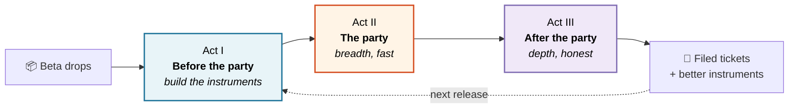
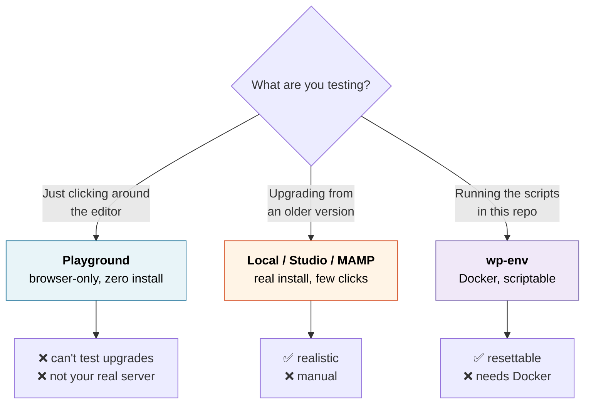
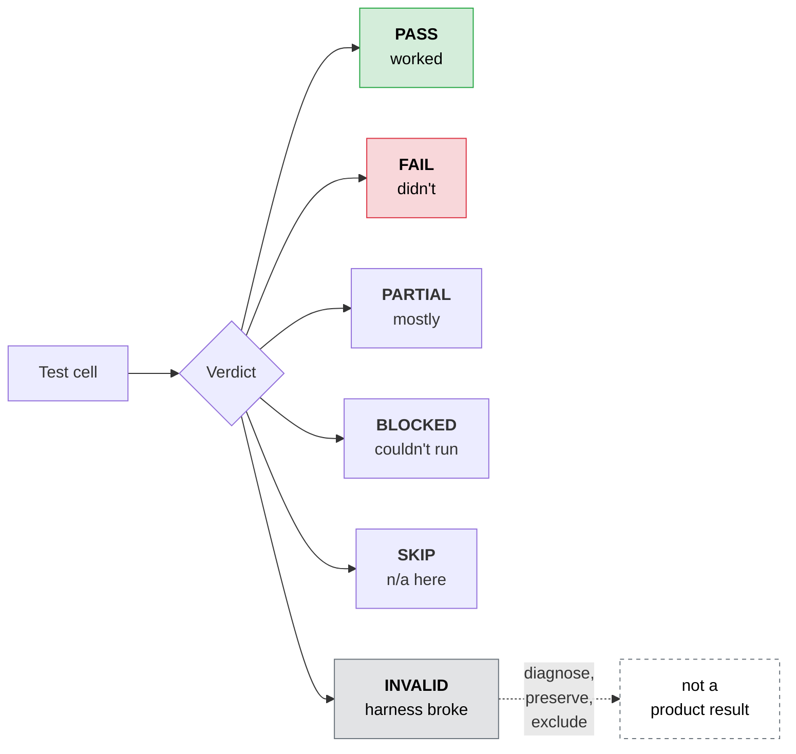

# Testing WordPress releases

*How to test a WordPress beta so that your "it works!" means something, and your "it's
broken!" gets fixed.*

[](LICENSE)
[](https://make.wordpress.org/test/)
[](CONTRIBUTING.md)

Anyone can install a beta, click around, and report "seems fine." That takes an hour and
helps approximately no one. This is the other thing — testing where a pass is evidence and a
failure is actionable.



## Who this is for

You run WordPress sites. You can follow instructions in a terminal. You've offered to help
test a beta — or you'd like to, and you're not sure what "helping" actually looks like.

You are **not** expected to read WordPress core code, write PHP, or know what a changeset is.

> [!NOTE]
> If you've ever thought *"I tested the beta and it seemed fine, but I don't think that
> helped anyone"* — you were probably right, and this is the fix.

## Contents

| | |
|---|---|
| **Get going** | [Before you start](#before-you-start) · [Check the build](#step-1-check-the-build-60-seconds) · [Get a test site](#step-2-get-a-test-site) · [Run the suites](#step-3-run-the-test-suites) · [Preflight](#step-4-check-what-your-setup-can-detect) |
| **The main event** | [A release party in three acts](#a-release-party-in-three-acts) |
| **Get it right** | [Five ways your test can lie to you](#five-ways-your-test-can-lie-to-you) · [How to report](#how-to-report-what-you-find) · [Official sources](#where-official-information-lives) |
| **Tooling** | [AI assistants](#using-ai-assistants) · [Tools and integrations](#tools-and-integrations) |
| **Reference** | [What's in here](#whats-in-this-repository) · [Safety](#safety-and-scope) · [Known gaps](#known-gaps) |

---

## Before you start

**You need:**

- A terminal (Mac, Linux, or Windows with WSL)
- The beta or RC `.zip` from [wordpress.org/download/releases](https://wordpress.org/download/releases/)

**You'll want soon, but not yet:**

- A local WordPress setup — [three options below](#step-2-get-a-test-site)
- A [WordPress.org account](https://login.wordpress.org/register), for reporting
- [Making WordPress Slack](https://make.wordpress.org/chat/), where testing is coordinated

**Grab this guide and its scripts:**

```bash
git clone https://github.com/courtneyr-dev/wp-release-audit-method.git
cd wp-release-audit-method
```

---

## Step 1: Check the build (60 seconds)

Do this first. No WordPress install, no Docker, no database. Just the zip you downloaded.

```bash
bash scripts/fast-triage.sh ~/Downloads/wordpress-7.2-beta1.zip
```

```
════ BUILD IDENTITY
  $wp_version = '7.2-beta1'
  $wp_db_version = 61840
  sha256: 4f3a...

════ FILES REMOVED BUT NOT DECLARED IN $_old_files
  wp-includes/images/icon-library/  (243 files)
```

**That second section is the money.** WordPress keeps an internal list of files it should
delete during an upgrade (`$_old_files`). When files get removed from the codebase but
nobody adds them to that list, upgrading sites *keep the old files forever*.

During WordPress 7.1 testing this found **243 leftover files**. A fresh install can never
show you this, because a fresh install has no old files to leave behind.

**Comparing two builds is even better:**

```bash
bash scripts/fast-triage.sh ~/Downloads/wordpress-7.2-RC1.zip ~/Downloads/wordpress-7.2-beta4.zip
```

> [!TIP]
> Run this the minute a build drops. It costs one minute and tells you where the next hour
> is best spent.

---

## Step 2: Get a test site

> [!CAUTION]
> **Never test a beta on a real site.** Not "a small one." Not "just to look." Betas eat
> databases.



### Option A — WordPress Playground

[WordPress Playground](https://wordpress.org/playground/) runs WordPress in your browser.
Nothing to install; throw it away by closing the tab.

[Docs](https://developer.wordpress.org/playground/) ·
[Make/Playground](https://make.wordpress.org/playground/) ·
[a worked beta blueprint](https://github.com/courtneyr-dev/WP7-testing)

**Can't do:** upgrades from older versions, or anything about your real server's PHP and
image libraries.

### Option B — a local app

[Local](https://localwp.com/), [Studio](https://developer.wordpress.com/studio/), or
[MAMP](https://www.mamp.info/). A real install in a few clicks. Best for upgrade testing —
install the *previous* version, add content, then upgrade to the beta.

### Option C — wp-env

[`@wordpress/env`](https://developer.wordpress.org/block-editor/reference-guides/packages/packages-env/)
is WordPress's own Docker environment, and what the scripts here drive — it can reset a
database and switch versions on command.

Needs [Docker](https://www.docker.com/products/docker-desktop/) and
[Node.js](https://nodejs.org/):

```bash
npm install -g @wordpress/env
mkdir ~/wp-test && cd ~/wp-test
echo '{"core":"WordPress/WordPress#master"}' > .wp-env.json
wp-env start
```

It prints your URL (usually `http://localhost:8888`). Pass that directory and URL to the
scripts below.

---

## Step 3: Run the test suites

```bash
bash scripts/crud-suite.sh ~/wp-test http://localhost:8888
```

| Script | Checks | Time |
|---|---|---|
| `fast-triage.sh` | Build identity, changed files. **No site needed** | 1 min |
| `preflight-sensitivity.sh` | What your environment can and can't detect | 1 min |
| `crud-suite.sh` | Posts, comments, media, categories | 5 min |
| `users-pages-install.sh` | Users, pages, installs, password-protected content | 10 min |
| `verify.sh` | One upgrade, captured cleanly | 5 min |
| `direct-jump-matrix.sh` | Upgrading from each older WordPress series | 30 min+ |
| `stepped-chain.sh` | WordPress 4.9 → today on one database | 30 min+ |
| `multisite-suite.sh` | Multisite networks | 15 min |
| `multisite-11.sh` | 10 subsites, built old then upgraded | 20 min |
| `seed-screenshot-rig.sh` | A site that makes presentable screenshots | 10 min |
| `lib-fast.sh` | Not a test — makes long suites ~12× faster | — |

Save the output. You'll want it when reporting.

### Point them at your release

`fast-triage.sh` takes the zip as an argument, so it already works anywhere. Five others
have the 7.1 beta URL baked in near the top:

```bash
cd scripts
sed -i '' 's|wordpress-7.1-beta4.zip|wordpress-7.2-beta1.zip|g' \
  verify.sh crud-suite.sh users-pages-install.sh multisite-suite.sh stepped-chain.sh
```

*(Linux: drop the `''` after `-i`.)* Two others take the target directly:
`direct-jump-matrix.sh` as a third argument, `multisite-11.sh` via `TARGET_ZIP=`.

Patches that fix the other five: genuinely welcome, genuinely easy, good first contribution.

---

## Step 4: Check what your setup can detect

```bash
bash scripts/preflight-sensitivity.sh ~/wp-test
```

This reports what your environment is *physically capable of noticing* — whether your zip
library is old enough to reproduce a known class of archive bugs, which image-processing
libraries you actually have, and so on.

> [!IMPORTANT]
> **A test that passes on an environment that couldn't have detected the failure is not
> evidence.** It's a very confident shrug. Save this output next to your results and include
> it when you report.

---

## A release party in three acts

WordPress ships betas and release candidates on a schedule, and the community tests them
together in [`#core-test`](https://make.wordpress.org/chat/). That's a **release party**.

Most people show up, install the build, poke at it, and post "looks good to me." Nothing
wrong with that. But the testing that actually finds things has a shape, and the shape has
three acts.

```mermaid
flowchart LR
    subgraph ACT1["<b>Act I · Before</b>"]
        direction TB
        A1["Build-identity gate<br/><i>does it exist yet?</i>"] --> A2["Build fixtures"]
        A2 --> A3["Seed content"]
        A3 --> A4["Assert state"]
        A4 --> A5["Calibrate controls"]
    end

    subgraph ACT2["<b>Act II · The party</b>"]
        direction TB
        B1["Re-run the gate"] --> B2["T1 sweep<br/><i>~61 cells</i>"]
        B2 --> B3["Upgrade ladder<br/><i>9 cells</i>"]
        B3 --> B4["Post the checklist"]
        B4 --> B5["Thread the detail"]
    end

    subgraph ACT3["<b>Act III · After</b>"]
        direction TB
        C1["Recheck filed tickets"] --> C2["Retest the fixes"]
        C2 --> C3["Deep chain audit"]
        C3 --> C4["Draft new tickets"]
        C4 --> C5["Feed the loop"]
    end

    A5 --> B1
    B5 --> C1

    style ACT1 fill:#e8f4f8,stroke:#21759B,stroke-width:2px,color:#000
    style ACT2 fill:#fff4e6,stroke:#D54E21,stroke-width:2px,color:#000
    style ACT3 fill:#f0e8f8,stroke:#826EB4,stroke-width:2px,color:#000
```



Each act has a skill in [`skills/`](skills/) if you want an AI assistant to run it, or a
playbook if you'd rather drive.

---

### Act I — Before the party

> **The goal:** show up on release day with instruments that already work.
> **The skill:** [`wp-release-prep`](skills/wp-release-prep/)

Nothing is more demoralizing than spending the release party fighting Docker while everyone
else finds bugs. Act I is provisioning, done the day before, so party day is spent testing.

**1. The build-identity gate — always first.**

Before anything else, confirm the build you want *actually exists*. If RC1 hasn't shipped
yet, you cannot test RC1. This sounds too obvious to need a rule, which is exactly why it
needs a rule: the failure mode is testing beta4, labeling it RC1, and reporting results
about a build nobody can reproduce.

> [!WARNING]
> Never substitute a beta, trunk, nightly, or prior RC for a build that doesn't exist yet.
> If the target isn't out, still build your fixtures — they're reusable — but mark every
> result `WAITING` and say so.

When the build does exist, pin it: package URL, checksum, `$wp_version`, `$wp_db_version`,
bundled Gutenberg version, Field Guide URL.

**2. Build the fixtures.**

The minimum set for a useful party:

| Fixture | Why it exists |
|---|---|
| Single site, current PHP | The everyday smoke lane |
| Multisite: main + normal + archived + spam + deleted | Catches held-back sites hiding behind a success count |
| Previous stable → target | The Core-updater lane |
| Previous beta → target | The prior-beta lane |
| Clean install of target | The baseline you diff everything against |

That multisite fixture looks fussy. It exists because a network upgrade once reported "2 of
2 sites upgraded" when there were five — three were archived or spam, got skipped, and sat
on the old database version, quietly broken. You cannot catch that without a fixture that
*has* archived and spam sites in it.

> [!IMPORTANT]
> **Keep the Core updater and WP-CLI updater in separate lanes.** They produce different
> file trees. That difference is exactly how the 243-stale-file finding surfaced — WP-CLI
> cleaned them all up and said so; WordPress's own updater left them.

**3. Seed real content.**

Import [theme-test-data](https://github.com/WordPress/theme-test-data) into every fixture:

```bash
curl -sL -o /tmp/theme-unit-test-data.xml \
  https://raw.githubusercontent.com/WordPress/theme-test-data/master/themeunittestdata.wordpress.xml
wp plugin install wordpress-importer --activate
wp import /tmp/theme-unit-test-data.xml --authors=create
```

It covers markup edge cases, deeply nested menus, embeds, image alignments, unicode and RTL
strings, sticky and password-protected and scheduled posts, and page hierarchies five levels
deep — every shape your hand-made "Test Post 1" will never have.

Then go beyond it: a custom post type and taxonomy, a plugin with a `Requires Plugins`
dependency plus that dependency, a second user at a lower role, and media in every format
the release touches.

**4. Assert the state before you call it ready.**

Record, per fixture: WordPress version, `db_version`, PHP version, image stack, site mode,
full site inventory with status flags, active plugins and theme, user and content counts, a
fixture hash.

This feels like bureaucracy right up until the moment a test fails and you need to know
whether the *fixture* was wrong. Then it's the difference between a finding and a shrug.

**5. Calibrate the controls.**

Prove your instruments work before you trust them:

- A **positive control** — something you *expect* to fail, failing.
- A **negative control** — something you expect to pass, passing.

If you're planning any keyboard or screen-reader testing, a plain native control must pass
your setup *first*. Two testers once disagreed about a block for a week; the tool couldn't
drive an ordinary HTML button either.

**Act I is done when** every fixture has a passed state assertion, both controls are
calibrated, and the build manifest is pinned — or honestly marked `WAITING`.

---

### Act II — The party

> **The goal:** does this release break the ordinary things people do?
> **The skill:** [`wp-release-party`](skills/wp-release-party/)

Breadth, fast. Depth is Act III's job — resist the urge to chase the interesting thing now.

**Re-run the build-identity gate.** Yes, even though Act I passed it. Packages get
republished and labels move.

**Run the T1 sweep** — around 61 cells across single site, multisite subsite, and multisite
network. Command line first (scriptable, parallelizable), browser second (slow, and only for
the parts of the UI this release actually changed).

Each cell gets a verdict:



> [!NOTE]
> **`INVALID` is the most underused verdict in testing.** When Docker corrupts its storage,
> or a fixture is owned by root, or you counted the wrong sites — that's not WordPress
> failing. Diagnose it, write down the diagnosis, exclude the batch from your counts, and
> say you excluded it. A harness fault reported as a product bug wastes a contributor's
> afternoon and costs you their attention next time.

**Run the upgrade ladder** — 9 cells covering 4.9, 5.0, 6.2, 6.3, 6.6, 6.9, and 7.0.2 on
single site, plus 4.9 and 7.0.2 on multisite.

Every ladder fixture pins **PHP 7.4**, because that's the only band where both the oldest
source and the current target run. That means the ladder proves *the upgrade*, not the
modern runtime — and your report should say so, or someone will reasonably assume you tested
something you didn't.

**Post the report.** [`playbooks/slack-test-report-template.md`](playbooks/slack-test-report-template.md)
renders a checklist for `#core-test`. Before you hit send:

- Does the header name the build you *actually tested*? (beta ≠ RC)
- Does it name the upgrade method? (Beta Tester / WP-CLI / manual zip)
- Are invalid batches counted and excluded?
- Any local paths or credentials in there? Remove them.

**Then thread the detail.** Lead message is the checklist; one threaded reply per non-PASS
cell: mechanism → proof → consequence → what you *couldn't* prove → rerun recipe.

> [!TIP]
> **Size the consequence honestly.** "243 files remain after upgrade" sounds alarming.
> "Integrity hygiene — not a functional break, not a vulnerability" is the same fact,
> correctly sized. The second one gets fixed. The first one gets argued about.

**Act II is done when** every T1 cell has a verdict or an exact blocker, cleanup is verified,
the checklist is posted, and non-PASS cells are queued for Act III.

---

### Act III — After the party

> **The goal:** depth, and honesty about what you actually proved.
> **The skill:** [`wp-release-followup`](skills/wp-release-followup/)

The party's over, everyone's gone home, and this is where the real findings live. Four jobs,
in order, each gating the next.

**1. Did previously filed issues actually get resolved?**

Keep a register of what you've filed. For each open row, check its current status.

> [!WARNING]
> **A ticket marked "fixed" is not a fixed behavior.** It means someone believed they fixed
> it. Every closed item goes to step 2 for a runtime retest before you believe it.

**2. Retest everything newly resolved.**

Reproduce the **original failing condition** on the new build, with controls.

There's a trap here worth naming. If you can't reproduce the *old* failure on the *old*
build, you cannot claim the new build fixed it — you've only demonstrated that a test
passes, which it might always have done. A passing test is not a fix; it's a passing test.

And a source diff is not a runtime fix. Code that looks correct and code that behaves
correctly are different claims requiring different evidence.

> [!TIP]
> Anything that turns out genuinely fixed becomes a **permanent negative control**. If it
> ever starts failing again, your harness is wrong before WordPress is. This is how a test
> suite gets smarter instead of just longer.

**3. Run the deep audit.**

Feed Act II's failures into chain selection — testing *interactions* rather than features:

| What Act II showed | What to chase |
|---|---|
| A UI and an API disagreeing | Interface-parity chain |
| Ladder fails at one version but not its neighbor | Bisect between them; the boundary **is** the mechanism |
| Clean upgrade, divergent file tree or content count | Stale-file detector, multi-hop chain |
| Anything touching credentials or capabilities | Security lane, with a written threat model |

> [!CAUTION]
> **Test-generation humility.** Thirty-six test scenarios were once generated from a feature
> catalog. When someone checked them against actual WordPress source, **every single one**
> needed correcting or throwing out — a 36/36 error rate. Plausible-sounding capability
> relationships are exactly what a language model is good at inventing. Verify each step
> against source before you run it.

**4. Draft the tickets. Draft them.**

One draft per confirmed defect, routed by system — and every draft states its **evidence
ceiling**: what you proved, what you didn't, and what would change your mind.

That last part is what separates a report that gets fixed from one that gets closed as
`worksforme`.

**Act III is done when** every register row has a current status and a retest verdict, every
selected chain has an executed verdict or an exact blocker, drafts exist for each confirmed
defect, and the next build has a rerun recipe.

---

## Five ways your test can lie to you

Each of these produced a confidently wrong conclusion in real testing.

<table>
<tr><td width="60"><b>1</b></td><td>

**You upgraded with WP-CLI, so you tested WP-CLI.**

WordPress 7.1 beta 4 left 243 removed files behind through WordPress's own updater. WP-CLI's
updater cleaned all 243 and printed "243 files cleaned up." Same build, opposite result.

→ *Say which method you used. If you used one, you tested one. Most users are on WordPress's.*

</td></tr>
<tr><td><b>2</b></td><td>

**You tested a fresh install, so you learned nothing about upgrading.**

A fresh install starts clean by definition. An entire category of problems cannot appear.

→ *Report "fresh install." To test upgrades, install the previous version first, add
content, then upgrade.*

</td></tr>
<tr><td><b>3</b></td><td>

**Your success count had the wrong denominator.**

"2 of 2 sites upgraded." There were five. Three were archived or spam, got skipped, stayed
on the old database version. The report was true and useless.

→ *Count what you expect before you read what you got.*

</td></tr>
<tr><td><b>4</b></td><td>

**Your keyboard test failed because your tooling failed.**

Two testers disagreed for a week about whether a block worked with the keyboard. The testing
tool couldn't drive a plain HTML button either.

→ *Before reporting a keyboard or screen-reader failure, confirm a normal control on the
same page works.*

</td></tr>
<tr><td><b>5</b></td><td>

**You found something alarming that nobody can reach.**

Some functions look terrifying but are only callable by code already running inside
WordPress.

→ *Ask "who could actually do this, and what would they already need?" If the answer is
"full access," it's a note, not a vulnerability. Overstating severity once costs you the
benefit of the doubt forever.*

</td></tr>
</table>

> [!TIP]
> **And one thing worth doing:** when you chase something and it turns out fine, write that
> down too. "Checked and cleared" is real information, and it saves the next person the same
> hour. This repo ships a deliberately **refuted** test case for exactly this reason — a
> suite of only confirmed findings is a suite that has never been calibrated.

---

## How to report what you find

Four things turn "it broke for me" into something someone can act on:

1. **The exact build.** Beta 1 ≠ beta 4 ≠ RC 1. Check **Dashboard → Updates**, don't assume.
2. **How you upgraded.** Beta Tester plugin, WP-CLI, or manual zip.
3. **Your environment.** PHP version, single or multisite, plus your preflight output.
4. **Steps to reproduce**, specific enough for a stranger to follow.

| What you found | Where it goes |
|---|---|
| A bug in WordPress | [Core Trac](https://core.trac.wordpress.org/) — [search first](https://core.trac.wordpress.org/search); betas breed duplicates |
| Not sure it's a bug | [`#core-test`](https://make.wordpress.org/chat/) or the [Alpha/Beta forum](https://wordpress.org/support/forum/alphabeta/) |
| A bug on WordPress.org itself | [Meta Trac](https://meta.trac.wordpress.org/) |
| **A security vulnerability** | **[HackerOne](https://hackerone.com/wordpress) only** — never a public ticket, never a GitHub issue, never a PR here |

New to Trac? Read [Reporting Bugs](https://make.wordpress.org/core/handbook/testing/reporting-bugs/) first.

---

## Where official information lives

Most weak bug reports aren't wrong about the symptom. They're wrong about what was *supposed*
to happen — because someone read a planning post from four months ago, or asked an AI that
remembered an older version.

**[`sources/official-sources.md`](sources/official-sources.md)** is the full register,
including which source wins when two disagree.

| Your question | Where to look |
|---|---|
| Does this build exist? | [Release announcements](https://wordpress.org/news/) · [archive](https://wordpress.org/download/releases/) |
| Did this actually ship? | [Trac milestones](https://core.trac.wordpress.org/) + the package itself |
| Why did this change? | [Make/Core dev notes](https://make.wordpress.org/core/tag/dev-notes/) |
| What should I test? | [Make/Test](https://make.wordpress.org/test/) |
| How's it meant to work? | [Developer Resources](https://developer.wordpress.org/) · [user docs](https://wordpress.org/documentation/) |
| Has someone hit this? | [Trac search](https://core.trac.wordpress.org/search) · [Alpha/Beta forum](https://wordpress.org/support/forum/alphabeta/) |

> [!IMPORTANT]
> Two rules worth memorizing. **A ticket marked "fixed" does not prove it shipped** — check
> the package. And **when an announcement and the build disagree, the build wins** — and that
> disagreement is itself worth reporting.

---

## Using AI assistants

Hand this guide to an AI instead of reading it. Works in ChatGPT, Claude, Gemini — anything
that fetches URLs.

<details>
<summary><b>Get started testing a beta</b></summary>

```
Read https://raw.githubusercontent.com/courtneyr-dev/wp-release-audit-method/main/README.md

I want to help test the WordPress 7.2 beta. Walk me through it step by step.
I can use a terminal but I'm not a developer.
```

</details>

<details>
<summary><b>Plan around your setup and available time</b></summary>

```
Read https://raw.githubusercontent.com/courtneyr-dev/wp-release-audit-method/main/README.md
and https://raw.githubusercontent.com/courtneyr-dev/wp-release-audit-method/main/playbooks/release-day-sweep-playbook.md

I have a multisite install on PHP 8.2 and about two hours. What should I test,
and what will my setup be unable to detect?
```

</details>

<details>
<summary><b>Check a claim before repeating it</b></summary>

```
Read https://raw.githubusercontent.com/courtneyr-dev/wp-release-audit-method/main/sources/official-sources.md

I think WordPress 7.2 changed how X works. Which official source would confirm that,
and what would prove it actually shipped rather than just being planned?
```

</details>

<details>
<summary><b>Turn messy notes into a report</b></summary>

```
Read https://raw.githubusercontent.com/courtneyr-dev/wp-release-audit-method/main/playbooks/slack-test-report-template.md

Here's my terminal output and notes: [paste]

Write this up for #core-test. Then tell me which of my claims the output
doesn't actually support.
```

</details>

> [!WARNING]
> That last sentence matters more than it looks. **AI assistants agree with you by default**
> and will cheerfully promote "seemed broken" into "confirmed bug." Ask to be contradicted,
> every single time. That habit is most of what this repository is about.

---

## Tools and integrations

### Search Trac from your AI assistant (MCP)

[`courtneyr-dev/meta-trac`](https://github.com/courtneyr-dev/meta-trac) is a hosted server
that lets an assistant search WordPress Trac directly — so *"has anyone already reported
this?"* becomes a question you ask without leaving the terminal. Adapted from
[trac-mcp](https://github.com/Jameswlepage/trac-mcp) by James LePage. No coding required.

<details>
<summary><b>Claude Desktop config</b></summary>

`~/Library/Application Support/Claude/claude_desktop_config.json` (Mac) or
`%APPDATA%\Claude\claude_desktop_config.json` (Windows):

```json
{
  "mcpServers": {
    "wordpress-core-trac": {
      "command": "npx",
      "args": ["-y", "mcp-remote", "https://mcp-server-wporg-core-trac.meta-trac-wordpress.workers.dev/mcp"]
    },
    "wordpress-meta-trac": {
      "command": "npx",
      "args": ["-y", "mcp-remote", "https://mcp-server-wporg-meta-trac.meta-trac-wordpress.workers.dev/mcp"]
    }
  }
}
```

</details>

Claude Code:

```bash
claude mcp add wordpress-core-trac -- npx -y mcp-remote https://mcp-server-wporg-core-trac.meta-trac-wordpress.workers.dev/mcp
```

> [!NOTE]
> **Known limitation:** the API doesn't return a ticket's component and can't filter by
> milestone. Great for finding duplicates and reading tickets; useless for proving no ticket
> exists. During 7.1 roughly 84 open tickets couldn't be enumerated this way.

### Agent skills for the three acts

[`skills/`](skills/) has the release workflow as skills an assistant loads automatically.
Entirely optional — everything they do can be done by hand.

| Skill | Act |
|---|---|
| [`wp-release-prep`](skills/wp-release-prep/) | I — build and verify environments |
| [`wp-release-party`](skills/wp-release-party/) | II — the fast sweep and the report |
| [`wp-release-followup`](skills/wp-release-followup/) | III — recheck, retest, deep audit, draft |
| [`wordpress-audit-handoff`](skills/wordpress-audit-handoff/) | Package findings for a colleague |
| [`wp-screenshots`](skills/wp-screenshots/) | Clean admin and front-end captures |

```bash
cp -R skills/wp-release-* ~/.claude/skills/
```

See [`skills/README.md`](skills/README.md) — including why running several AI skills over one
question gives you less independent confirmation than it looks like.

### WordPress's own AI surface

Core is growing one — see [Introducing the WordPress MCP
adapter](https://developer.wordpress.org/news/2026/02/from-abilities-to-ai-agents-introducing-the-wordpress-mcp-adapter/)
and [Make/Core AI](https://make.wordpress.org/ai/). Worth watching, and worth testing when it
lands.

### Prompt collections

- [`courtneyr-dev/wp-dev-prompts`](https://github.com/courtneyr-dev/wp-dev-prompts) —
  WordPress development: security, block and theme dev, testing and QA, performance,
  accessibility, Playground, UI/UX audit
- [`courtneyr-dev/developer-education-prompts`](https://github.com/courtneyr-dev/developer-education-prompts) —
  documentation and training material
- [`prompts/`](prompts/) here — prompts that make an assistant read source instead of guessing

### Related testing projects

- [`courtneyr-dev/wp7-test-automation`](https://github.com/courtneyr-dev/wp7-test-automation) —
  Playwright runner, 123 steps across 14 areas
- [`courtneyr-dev/WP7-testing`](https://github.com/courtneyr-dev/WP7-testing) — beta launcher
  and Playground blueprint

### The official tools underneath

[WP-CLI](https://wp-cli.org/) ([handbook](https://make.wordpress.org/cli/)) ·
[wp-env](https://developer.wordpress.org/block-editor/reference-guides/packages/packages-env/) ·
[Playground](https://wordpress.org/playground/) ·
[Beta Tester plugin](https://wordpress.org/plugins/wordpress-beta-tester/) ·
[Make/Test handbook](https://make.wordpress.org/test/handbook/)

---

## What's in this repository

```
├── scripts/      the test scripts from Step 3
├── sources/      where official WordPress information lives
├── skills/       the three acts, as AI assistant skills (optional)
├── playbooks/    longer runbooks: security, performance, content, release day
├── examples/     four worked investigations, with evidence and cleanup
├── prompts/      prompts for AI-assisted testing
└── method/       the reasoning behind all of it
```

### If you want to go further

The most valuable testing looks at **interactions between features**, not features one at a
time. Every confirmed problem in the WordPress 7.1 cycle lived in one — a check running in
the wrong order, a counter reading the wrong setting, an updater disagreeing with what it
shipped. Testing features individually finds none of those.

Start with [`examples/chains/C-02/`](examples/chains/C-02/) — the leftover-files finding,
start to finish. Then [`method/release-audit-learning-loop.md`](method/release-audit-learning-loop.md).

---

## Safety and scope

> [!CAUTION]
> **This is for testing public WordPress releases on disposable local sites.** Not a live
> site, not WordPress.org's servers, not anyone else's site, not plugins or themes you don't
> own. No password guessing. No scanning things you don't run.

The scripts create throwaway installs with obvious placeholder logins (`admin` / `password`).
That's fine because the sites are disposable and local — **don't copy that pattern anywhere
real.**

Security vulnerabilities go to [HackerOne](https://hackerone.com/wordpress). Not Trac, not
GitHub, not here. Findings under coordinated disclosure appear in this repo as a bare
acknowledgment only, with no reproduction steps until a fix ships.

## Known gaps

Stated plainly so you don't mistake them for tested ground:

- The **performance playbook has never been run.** It describes what a good benchmark would
  look like. Treat it as a plan, not a procedure.
- Two checks (Core updater vs. WP-CLI, real-input accessibility) are written but haven't been
  exercised against a release candidate.
- A complete list of open Trac tickets still needs a human with a browser.

## Contributing

Contributions welcome — **including tests that found nothing.** A test that checked something
and cleared it is useful and gets merged. See [CONTRIBUTING.md](CONTRIBUTING.md).

## License

GPLv2 or later — see [LICENSE](LICENSE). Same license as WordPress.
