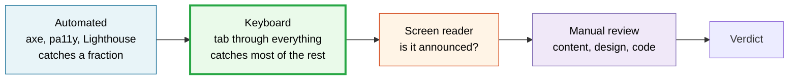

# Accessibility testing

*Not a separate pass. A dimension of every pass.*

Accessibility is treated throughout this project as something you check **while** you test, not as an
audit you schedule afterwards. A release that ships a keyboard trap is broken in the same way a
release that ships a fatal error is broken — it just fails for fewer people, which is exactly why it
survives testing that isn't looking.

> [!IMPORTANT]
> **The authoritative source is the [WordPress Accessibility knowledge base](https://wpaccessibility.org/docs/testing/).**
> This page is an index into it plus the harness for running its guidance during a release cycle.
> When the two disagree, they are right.

## The layered method



The knowledge base is explicit that **automated testing cannot catch all accessibility errors** and
that manual keyboard testing has to be part of the regular workflow. Automation is the cheap first
filter, not the answer. A green axe run means "no *detectable* violations," which is a much smaller
claim than "accessible."

Keyboard testing is the highest-value manual step: cheap, needs no special software, and finds the
failures that stop people using the thing at all.

---

## Automated

Per [the knowledge base](https://wpaccessibility.org/docs/testing/automated/):

| Tool | Form | Use it for |
|---|---|---|
| [**axe-core**](https://github.com/dequelabs/axe-core) (Deque) | CLI, Playwright, React, browser extension | The default. Playwright integration makes it CI-native |
| [**Pa11y**](https://pa11y.org/) | CLI and Node | Scriptable sweeps across many URLs |
| [**IBM Equal Access**](https://www.ibm.com/able/toolkit/tools/) | Engine + browser extension | A second opinion with different rules |
| [**W3C validators**](https://validator.w3.org/) | Nu HTML Checker, CSS Validator, Link Checker | Invalid HTML causes accessibility bugs downstream |
| **Lighthouse** | Chrome DevTools | Convenient; runs axe-core underneath |

Running two engines is worth it. They don't implement identical rule sets, and the delta is
informative.

```bash
# Quick one-off
npx @axe-core/cli http://localhost:8888
npx pa11y http://localhost:8888 --standard WCAG2AA
```

For CI, see [`plugin-theme-authors/ci/`](../plugin-theme-authors/ci/) — the accessibility job runs
axe against your admin and front-end screens on every push.

---

## Keyboard — the one to do every time

Straight from [the knowledge base procedure](https://wpaccessibility.org/docs/testing/keyboard/):

1. **Tab through pages, links, and forms.**
2. **Every link reachable and activatable by keyboard**, including links inside drop-downs.
3. **Every link has a strong visible focus indicator.**
4. **Focusable visually hidden content — skip links — becomes visible when focused.**
5. **Every interaction possible with a mouse is possible from the keyboard.**

> [!TIP]
> **Mac users: turn on full keyboard navigation first.** System Settings → Keyboard → "Keyboard
> navigation." Without it, Safari and Chrome skip buttons and your test silently under-reports.
> This alone invalidates a lot of casual keyboard testing on macOS.

**Test both with and without a screen reader running.** The knowledge base is specific about why:
screen reader use of the keyboard can override custom keyboard scripting, so a control that works
with a screen reader on may fail with it off, and vice versa.

### Keys worth knowing

| Key | Expected |
|---|---|
| `Tab` / `Shift+Tab` | Move forward/back through focusable elements in a sensible order |
| `Enter` | Activate links and buttons |
| `Space` | Activate buttons, toggle checkboxes |
| `Arrow keys` | Move within composite widgets — menus, tabs, radio groups |
| `Escape` | Close modals and menus, returning focus where it came from |

### The failures to look for

- **Invisible focus** — you tab and can't tell where you are. Extremely common; often a CSS reset
  that removed the outline.
- **Focus traps** — you tab into something and can't get out.
- **Lost focus** — a modal closes and focus lands on `<body>`, dumping the user back at the top.
- **Illogical order** — visual order and DOM order disagree, usually from CSS positioning.
- **Mouse-only controls** — a `<div>` with a click handler and no keyboard equivalent.
- **Skip links that don't appear** on focus, or don't move focus when activated.

---

## Screen readers

[Knowledge base guidance](https://wpaccessibility.org/docs/testing/screen-readers/). You don't need
to be an expert user to find real bugs — you need to answer one question: **is this announced, and
is what's announced true?**

| Platform | Reader | Notes |
|---|---|---|
| macOS | VoiceOver | Built in — `Cmd+F5` |
| Windows | NVDA | Free |
| Windows | JAWS | Commercial, widely used |
| Android / iOS | TalkBack / VoiceOver | Mobile behavior differs meaningfully |

What to check: does every control announce a **name**, a **role**, and its **state**? Does a change
in one part of the page get announced when it happens elsewhere? Are images given useful alternative
text, and decorative ones left silent?

---

## Manual review

The knowledge base splits the rest into [content](https://wpaccessibility.org/docs/testing/content/),
[design](https://wpaccessibility.org/docs/testing/design/),
[code](https://wpaccessibility.org/docs/testing/code/), and
[an overall pass](https://wpaccessibility.org/docs/testing/overall/). Highlights that recur in
WordPress testing:

- **Heading structure** — one `h1`, no skipped levels. The fastest structural smell test there is.
- **Colour contrast** — 4.5:1 for body text, 3:1 for large text and UI components.
- **Zoom and reflow** — 200% zoom, and 400% at 1280px wide without horizontal scrolling.
- **Form labels** — every field programmatically labelled, errors associated with their field.
- **Link text** — meaningful out of context. Not "read more."
- **Landmarks** — header, nav, main, footer present and correct.
- **Motion** — respects `prefers-reduced-motion`.

---

## For theme authors: accessibility-ready

WordPress.org runs an [**accessibility-ready**](https://wpaccessibility.org/docs/accessibility-ready/)
review programme for directory themes. Even if you never apply for the tag, **its guidelines are the
best-defined accessibility checklist in the WordPress ecosystem** — and they're what a reviewer will
hold you to.

The [theme guidelines](https://wpaccessibility.org/docs/accessibility-ready/theme-guidelines/) cover:

| Guideline | |
|---|---|
| [Skip to content](https://wpaccessibility.org/docs/accessibility-ready/theme-guidelines/skip-to-content/) | [Keyboard navigation support](https://wpaccessibility.org/docs/accessibility-ready/theme-guidelines/keyboard-navigation-support/) |
| [Headings structure](https://wpaccessibility.org/docs/accessibility-ready/theme-guidelines/headings-structure/) | [Meaningful landmark roles](https://wpaccessibility.org/docs/accessibility-ready/theme-guidelines/meaningful-landmark-roles/) |
| [Controls with accessible names](https://wpaccessibility.org/docs/accessibility-ready/theme-guidelines/controls-with-accessible-names/) | [Labeled form fields](https://wpaccessibility.org/docs/accessibility-ready/theme-guidelines/labeled-form-fields/) |
| [Alternative text](https://wpaccessibility.org/docs/accessibility-ready/theme-guidelines/alternative-text/) | [Screen reader text](https://wpaccessibility.org/docs/accessibility-ready/theme-guidelines/screen-reader-text/) |
| [No ambiguous link text](https://wpaccessibility.org/docs/accessibility-ready/theme-guidelines/no-ambiguous-link-text/) | [New windows and tabs](https://wpaccessibility.org/docs/accessibility-ready/theme-guidelines/new-windows-tabs/) |
| [Content on hover or focus](https://wpaccessibility.org/docs/accessibility-ready/theme-guidelines/content-hover-focus/) | [Accessible animation](https://wpaccessibility.org/docs/accessibility-ready/theme-guidelines/accessible-animation/) |
| [Reflow and resize](https://wpaccessibility.org/docs/accessibility-ready/theme-guidelines/reflow-resize/) | [No inaccessible plugins](https://wpaccessibility.org/docs/accessibility-ready/theme-guidelines/no-inaccessible-plugins/) |
| [Accessibility statement](https://wpaccessibility.org/docs/accessibility-ready/theme-guidelines/accessibility-statement/) | |

There's also a [theme testing workflow](https://wpaccessibility.org/docs/accessibility-ready/testing-themes/theme-testing-workflow/),
a [setup guide](https://wpaccessibility.org/docs/accessibility-ready/testing-themes/setup/), and a
[reporting sheet](https://wpaccessibility.org/docs/accessibility-ready/testing-themes/reporting-sheet/)
— which is a better report format than anything this repo would invent.

---

## The calibration rule this project learned the hard way

> **A native control must pass your harness before any product verdict counts.**

Two testing sessions once disagreed for a week about whether a block worked with the keyboard. The
tie broke when someone checked whether the earlier run's **plain HTML button** passed the same
synthetic keypress. It didn't. The tool was broken, not WordPress.

That's [lie #4](../README.md#five-ways-your-test-can-lie-to-you), and it is *specifically* an
accessibility-testing failure mode, because synthetic input and real assistive technology behave
differently. Before you report that something is inaccessible:

1. Put a plain `<button>` and a plain `<a href>` on the same page.
2. Drive them with the same method you're about to test with.
3. **If the native control fails, your harness is wrong.** Stop and fix that first.

Accessibility findings are the easiest to get wrong and the most damaging to get wrong publicly —
they read as an accusation. Calibrate first.

---

## Reporting

Same standard as everything else here: mechanism → evidence → consequence, plus the two accessibility
reports need specifically.

- **Name the barrier, not the violation.** "Keyboard users cannot reach the submit button" beats
  "fails WCAG 2.1.1" — one describes a person, the other a reference number. Cite the criterion as
  well, but lead with the human consequence.
- **Say how you tested.** Browser, OS, assistive technology and version, and whether full keyboard
  navigation was enabled. An accessibility result without an environment is unreproducible.
- **Say whether a native control passed.** One line: *"native button passes the same input."*

Where it goes:

| What | Where |
|---|---|
| WordPress core | [Trac](https://core.trac.wordpress.org/), component **Accessibility**; and [`#accessibility`](https://make.wordpress.org/chat/) in Slack |
| Gutenberg / editor | [Gutenberg issues](https://github.com/WordPress/gutenberg/issues), label `Accessibility` |
| A directory theme or plugin | Its own tracker; themes claiming `accessibility-ready` are held to the guidelines above |

The [Make/Accessibility team](https://make.wordpress.org/accessibility/) coordinates this work and
welcomes testers.

---

## Where it's baked in

| Place | What it does |
|---|---|
| [Release-day sweep](../playbooks/release-day-sweep-playbook.md) | Accessibility rows in the T1 matrix |
| [Plugin & theme guide](../plugin-theme-authors/README.md) | Accessibility in the compatibility matrix |
| [Testing blocks](../plugin-theme-authors/testing-blocks.md) | Editor accessibility, which is where regressions concentrate |
| [CI workflows](../plugin-theme-authors/ci/) | An axe job on every push |
| [Starter tests](../plugin-theme-authors/starter-tests/) | A Playwright + axe spec |
| [Surface inventory](../scripts/wp-surface-inventory.sh) | Flags ARIA, `tabindex`, and screen-reader-text usage |
| [Slack report template](../playbooks/slack-test-report-template.md) | Accessibility checks in the posted checklist |

## Related

[WordPress Accessibility knowledge base](https://wpaccessibility.org/docs/testing/) ·
[Make/Accessibility](https://make.wordpress.org/accessibility/) ·
[WCAG](https://www.w3.org/WAI/standards-guidelines/wcag/) ·
[i18n and RTL](../i18n/) · [Official sources](../sources/official-sources.md)
