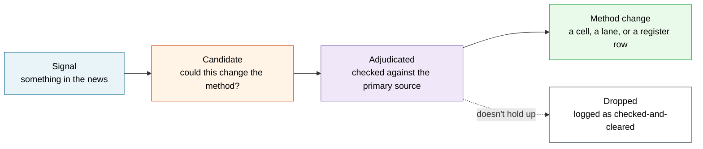

# Ecosystem signals

The method improves two ways: from **running it** (see [retro](retro.md)) and from **reading
the ecosystem** — dev notes, security releases, incident write-ups, conference talks, plugin
trackers. The WP Rocket lane exists because someone read an outage post-mortem, not because a
cell failed. This document makes that reading a routine instead of a lucky catch.

## The pipeline — a signal is not a method change

Same discipline as everywhere else here: a signal is a claim until it's adjudicated. Four
stages, and skipping straight from signal to cell is the failure this guards against.



A signal that survives adjudication becomes a [failure-mode](registers.md) row (the way the
method was blind) plus a [method-change proposal](registers.md) (the fix). A signal that
doesn't survive is logged as **checked-and-cleared** — real information that saves the next
person the same hour, exactly as the README argues for refuted findings.

## The sources worth a standing watch

Official and allowlisted only, per [the source register](../sources/official-sources.md):

| Source type | What it changes about the method | Example |
|---|---|---|
| **Make/Core dev notes** | New surfaces, changed internals plugins reach into | the 6.7 just-in-time translation change → the i18n cells |
| **Security releases** | Backport-matrix rows, new invariant checks | 7.0.3/7.0.4 → [`data/security-releases.csv`](../data/security-releases.csv) |
| **Incident write-ups** | Whole new lanes | the WP Rocket outage → [the ecosystem lane](ecosystem-compatibility-lane.md) |
| **Conference talks** (WCUS, WCEU) | Practice this repo hasn't encoded | Miler's update-day runbook → [fleet operators](../fleet-operators/README.md) |
| **Host and agency tooling** released after an incident | The fix the people who got hit actually built | Ginder's CaptainCore `update-core` → [preflight core probe](preflight-core-probe.md) |
| **Plugin trackers** (your fleet) | Release-readiness inputs before the release | the WP Rocket fix sat on its tracker 44 days early |
| **Trac milestones** for the upcoming release | What to build cells for this cycle | the change ledger that drives `BROWSER_T1` |

The tooling row has a register and a cron of its own, because it is the one source type
where the signal is a *diff* rather than an event: [`sources/upstream-techniques.md`](../sources/upstream-techniques.md)
and `scripts/upstream-watch.py`. Everything it surfaces still enters the pipeline above at
**Signal**, not at **Method change**.

The cross-source rule the corpus keeps proving: **a signal from any of these needs a human
adjudication gate before it becomes a check** — the same "scanner output requires verification"
convergence the accessibility and security lanes cite. Reading widely is the cheap first
filter, not the verdict.

## The routine, and the script

`scripts/ecosystem-signals.sh` reads a signals source you control and flags the items that
plausibly touch the method — mentions of the upcoming release, of a plugin in your fleet, of a
release in the security-backport matrix, or of an incident shape (fatal / regression / RCE /
deprecated near a version).

```bash
# your notes export, an RSS-to-text dump, a folder of clippings — whatever you keep
export WP_AUDIT_SIGNALS=~/path/to/your/ecosystem-notes
export WP_AUDIT_FLEET="wp-rocket,elementor-pro,woocommerce,contact-form-7"
bash scripts/ecosystem-signals.sh --version 7.2
```

It is a **triage aid, not an oracle** — it points you at lines worth reading, and every hit
still goes through adjudication before it becomes anything. It reads whatever you feed it and
never fetches your private notes anywhere; `WP_AUDIT_SIGNALS` stays on your machine. With no
signals source it falls back to the official release and dev-note feeds (read-only).

**Cadence:** once a week during a cycle, and again as an Act I step in
[`wp-release-prep`](../skills/wp-release-prep/SKILL.md) before you build fixtures — because the
change-ledger that selects this release's browser cells *is* an ecosystem-signals output.

## Where signals land

| Signal survives adjudication as… | It becomes… |
|---|---|
| A way the method was blind | a `failure-mode-register.csv` row (PROPOSED) |
| A fix for that blindness | a `method-change-proposals.csv` row (PROPOSED; ACCEPTED only after controls) |
| A new plugin/version to track | a fleet or `data/` update |
| Worth sharing beyond your run root | a [field report or method-improvement issue](../CONTRIBUTING.md#suggesting-improvements-from-real-use) |

The private registers hold your run's rows; the public repo gets the ones worth everyone's.
That's the [retro](retro.md)'s job to sort.
