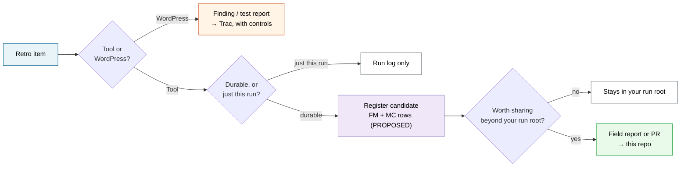

# Retro

Every run of a skill or playbook is data about the *tool*, not just about WordPress. The
method got sharper the last two cycles because someone noticed a script lied, a cell was
missing, or an instruction was confusing — and wrote it down. This makes that noticing a
routine instead of a mood. It is deliberately short; the repo values honesty over ceremony,
and a retro nobody runs because it's long is worse than no retro.

## The one distinction that makes a retro useful

**Was the tool wrong, or was WordPress wrong?** These go to different places and confusing
them is the whole trap:

- **WordPress was wrong** → that's a *finding* or a *test report*, not a retro item. It goes
  to Trac / the [test-report template](../.github/ISSUE_TEMPLATE/test-report.yml), with
  controls and an evidence ceiling.
- **The tool was wrong** — a script errored, a cell was missing, an instruction misled you, a
  count drifted, a path didn't resolve — *that's* a retro item. It feeds the
  [learning loop](release-audit-learning-loop.md).

This mirrors the `INVALID`-vs-`FAIL` discipline: a harness fault is never a product result,
and a tool gap is never a WordPress bug.

## The retro vocabulary

Four verdicts, kept separate from the smoke (`PASS`/`FAIL`/…) and finding
(`CONFIRMED`/`REFUTED`/…) vocabularies so nothing gets conflated:

| Verdict | Means | Where it goes |
|---|---|---|
| **KEEP** | Worked; worth protecting from a future "simplification" | a note in the run log; occasionally a regression test |
| **FRICTION** | Slowed you down but you got through | a `failure-mode-register.csv` candidate |
| **GAP** | Missing coverage — a cell, a lane, a driver, a doc | a `failure-mode-register.csv` candidate + a `method-change-proposals.csv` candidate |
| **WRONG** | The tool gave a wrong or misleading instruction/result | a `failure-mode-register.csv` candidate, highest priority |

A `KEEP` is real information — the README already argues that "checked and cleared" is worth
recording. Don't drop the wins; a method that only logs failures forgets why its rules exist.

## The routine

Fill in [`templates/skill-run-retro.md`](../templates/skill-run-retro.md) — four prompts, a
couple of minutes. It ends by sorting each item:

**The adjudication gate still applies.** A retro item is a *candidate* register row, status
`PROPOSED`. It becomes `ACCEPTED` only the way every rule here does — a new detector needs both
controls before it's trusted, a doc change needs to trace to a source. A retro lowers the
friction of *noticing*; it doesn't lower the bar for *accepting*.

## Sharing it

Most retro items stay in your run root — they're specific to your fleet or your setup. The ones
that would help the next stranger go to the repo, and the on-ramp is meant to be a two-minute
job: see [suggesting improvements from real use](../CONTRIBUTING.md#suggesting-improvements-from-real-use).
The bar for a *shared* item is low on purpose — a field report that just says "step 4 of the
party skill assumes Studio and I was on DDEV" is genuinely useful, and refuted or inconclusive
items are welcome, because they become negative controls.

## Where it's wired in

Each act ends with a retro pass:

| Skill | The retro asks |
|---|---|
| [`wp-release-prep`](../skills/wp-release-prep/SKILL.md) | Did the fixtures build as documented? Did any instruction assume a driver you weren't on? |
| [`wp-release-party`](../skills/wp-release-party/SKILL.md) | Did every cell run? Did a script error, or a count not match the matrix? |
| [`wp-release-followup`](../skills/wp-release-followup/SKILL.md) | Its §5 "Feed the loop" — the deep version of this, for chains and detectors |
