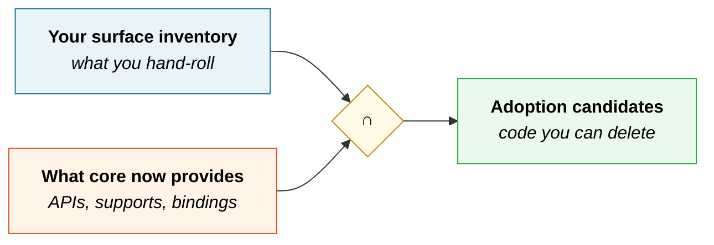

# Adopting what the release adds

*The other half of release testing: not "what breaks?" but "what can I delete?"*

Every cycle you check whether the release broke you. Almost nobody checks the opposite question —
**what does core now do for free that I'm still hand-rolling?** That's where the code deletions
live, and deleted code is the only code that never breaks in a future release.

The same intersection method works in reverse:



The [surface inventory tool](../scripts/wp-surface-inventory.sh) flags candidates automatically:

```bash
bash scripts/wp-surface-inventory.sh /path/to/your-plugin-or-theme
# → ══ ADOPTION CANDIDATES — core may already do this for you
```

Each flag is a **prompt to look**, not a verdict. Heuristics find patterns, not intent.

> [!IMPORTANT]
> **Adopting a new API raises your `Requires at least`.** That's a real cost — you drop users on
> older WordPress. Either bump the floor deliberately, or feature-detect and keep a fallback. Don't
> adopt something and quietly break older installs; check
> [the version each API needs](#which-version-each-api-needs) before you commit.

---

## Block supports — the biggest easy win

**What it is:** declare a support in `block.json`, and core generates the attribute, the editor UI
control, and the CSS. You write nothing.

**You're a candidate if:** your `block.json` has hand-rolled attributes named `color`,
`backgroundColor`, `textColor`, `fontSize`, `padding`, `margin`, `borderColor`, or `borderRadius` —
and matching controls in your `edit.js`.

```json
{
  "supports": {
    "color":      { "text": true, "background": true, "gradients": true },
    "spacing":    { "padding": true, "margin": true, "blockGap": true },
    "typography": { "fontSize": true, "lineHeight": true, "fontFamily": true },
    "border":     { "color": true, "radius": true, "style": true, "width": true },
    "shadow":     true,
    "dimensions": { "minHeight": true },
    "position":   { "sticky": true }
  }
}
```

The full key list: `color`, `spacing`, `typography`, `dimensions`, `background`, `shadow`, `filter`,
`position`, `layout`, `align`, `alignWide`, `anchor`, `className`, `customClassName`, `html`,
`inserter`, `lock`, `multiple`, `reusable`, `renaming`, `splitting`, `interactivity`, `ariaLabel`,
`allowedBlocks`.

Apply the generated attributes with `useBlockProps()` in the editor and
`get_block_wrapper_attributes()` in PHP render callbacks.

> [!NOTE]
> Several supports only show UI **if the theme opts in** via `theme.json` — `background`,
> `dimensions`, `position.sticky`, `spacing` (margin, padding, blockGap), and
> `typography.lineHeight`. If you declare a support and see no control, check the theme before
> assuming the support is broken. Test against a theme with `appearanceTools: true` *and* one
> without.

**Why it's worth doing:** every hand-rolled control is code you maintain, style, translate, and
keep accessible. The core version gets all of that from core, and it matches every other block the
user has ever used.

**Migration risk:** if you already ship a custom attribute with the same purpose, you need a
deprecation in your block so existing saved content still validates. Don't just swap them — users
have posts saved with your old markup.
[Block deprecations reference](https://developer.wordpress.org/block-editor/reference-guides/block-api/block-deprecation/).

---

## Interactivity API — for front-end behavior

**What it is:** a standard way to add front-end interactivity to blocks, shipped in **WordPress
6.5**. Directives in the markup, state in a store — no jQuery, no bespoke script wiring, and blocks
can talk to each other.

**You're a candidate if:** you enqueue jQuery for front-end behavior, ship a custom `view.js` that
manipulates your block's DOM, or have server-rendered dynamic blocks with a separate front-end
script.

Three steps to opt in:

```bash
npm install @wordpress/interactivity
```

```json
{
  "supports": { "interactivity": true },
  "viewScriptModule": "file:./view.js"
}
```

```html
<div data-wp-interactive="myplugin" data-wp-context='{"isOpen":false}'>
  <button data-wp-on--click="actions.toggle" data-wp-bind--aria-expanded="context.isOpen">Toggle</button>
  <p data-wp-bind--hidden="!context.isOpen">Content</p>
</div>
```

**Server-rendered blocks are the natural fit.** Your markup is already generated in PHP — adding
directives is less work than shipping a script that has to find and re-bind your elements.

**Why it's worth doing:** cross-block communication without custom event buses, no jQuery
dependency, and behavior that survives core's front-end changes because core maintains the runtime.

**The catch:** it's a genuine rewrite of your front-end logic, not a find-and-replace. Scope it as a
project. And it needs 6.5+ — if you support older, you're maintaining both paths for a while.

---

## Block Bindings — post meta without a custom block

**What it is:** bind dynamic data to attributes of **core** blocks, shipped in **WordPress 6.5**. A
core paragraph can render a post meta value directly.

**You're a candidate if:** you built a custom block whose only job is displaying a meta field, or
you have meta boxes surfacing data that users then retype into content.

Supported today:

| Block | Bindable attributes |
|---|---|
| `core/paragraph` | `content` |
| `core/heading` | `content` |
| `core/image` | `id`, `url`, `title`, `alt`, `caption` |
| `core/button` | `url`, `text`, `linkTarget`, `rel` |
| `core/navigation-link` | `url` |
| `core/navigation-submenu` | `url` |
| `core/post-date` | `datetime` |

Four core sources ship: `core/post-meta`, `core/post-data`, `core/term-data`, and
`core/pattern-overrides`.

```json
{
  "metadata": {
    "bindings": {
      "content": { "source": "core/post-meta", "args": { "key": "book_author" } }
    }
  }
}
```

**Requirement that trips people up:** `core/post-meta` only sees meta registered with
`register_meta()` and `show_in_rest => true`. If your meta isn't registered, or isn't exposed to
REST, bindings can't reach it. That registration is worth doing regardless — it's also what makes
your data available to the REST API and to the block editor generally.

**Custom sources** need a unique name, a label, and a callback returning the value. Register in PHP,
in JS, or both — the editor uses the JS registration for live preview, the front end uses the PHP
one.

**Why it's worth doing:** you delete a custom block, and users get their meta inside blocks they
already know how to style — with every block support you'd otherwise have reimplemented.

---

## theme.json — for themes

**Current schema is version 3** (WordPress 6.6+). Top-level keys: `$schema`, `version`, `settings`,
`styles`, `customTemplates`, `templateParts`, `patterns`.

### `appearanceTools: true` is the one-line win

```json
{ "version": 3, "settings": { "appearanceTools": true } }
```

That single line enables UI for background image and size, border (color, radius, style, width),
link/heading/button/caption color, dimensions (aspect ratio, min height), sticky position, spacing
(blockGap, margin, padding), and typography line height.

If the inventory tool says `appearanceTools: NOT enabled`, that's the cheapest improvement available
to your theme.

### `add_theme_support()` calls theme.json supersedes

The tool flags these. Move them:

| Old `add_theme_support()` | theme.json equivalent |
|---|---|
| `editor-color-palette` | `settings.color.palette` |
| `editor-font-sizes` | `settings.typography.fontSizes` |
| `editor-gradient-presets` | `settings.color.gradients` |
| `custom-line-height` | `settings.typography.lineHeight` |
| `custom-spacing` | `settings.spacing.padding` / `margin` |
| `custom-units` | `settings.spacing.units` |
| `align-wide` | `settings.layout.wideSize` |
| `disable-custom-colors` | `settings.color.custom: false` |
| `disable-custom-font-sizes` | `settings.typography.customFontSize: false` |

Some `add_theme_support()` calls are **not** superseded and should stay: `post-thumbnails`,
`title-tag`, `html5`, `custom-logo`, `automatic-feed-links`, `editor-styles` (still needed to load a
stylesheet), `responsive-embeds`, `wp-block-styles`.

### Per-block settings and styles

`settings.blocks` and `styles.blocks` let you configure one block without touching the rest — a
narrower tool than global overrides and much easier to reason about later.

### Style variations

Drop JSON files in `styles/` and users get selectable alternate looks from the Site Editor. Cheap to
add if you already have theme.json, and a visible feature for very little code.

---

## Which version each API needs

Adoption costs you users on older WordPress. Decide deliberately.

| API | Needs | If you support older |
|---|---|---|
| Block supports (core set) | Long-established; check the specific key | Most are safe |
| Interactivity API | **6.5** | Keep the old script path behind a version check |
| Block Bindings | **6.5** | Custom block stays as fallback |
| theme.json v3 | **6.6** | v2 still works; migrate when your floor allows |
| `appearanceTools` | Widely available | Safe |

```php
// Feature-detect rather than version-check where you can — it survives backports.
if ( function_exists( 'wp_interactivity_state' ) ) {
    // new path
} else {
    // legacy path
}
```

Then reflect the decision in `readme.txt`:

```
Requires at least: 6.5
```

And [re-run the compatibility matrix](README.md#the-compatibility-matrix) at that floor — bumping
`Requires at least` means your *oldest supported* target moved, which is a testing change, not just
a metadata change.

---

## Fitting adoption into the cycle

Adoption belongs in **[Act I](../README.md#act-i--before-the-drop)** — before the beta, while you're
already reading dev notes. Not during the party; that's for finding breakage, and mixing the two
means neither gets done properly.

A reasonable cadence: pick **one** adoption item per release. Ship it in its own release, separate
from your compatibility fix, so if something regresses you know which change caused it.

```markdown
## Adoption pass — WP <VERSION>

- [ ] `wp-surface-inventory.sh` run; adoption candidates reviewed
- [ ] Dev notes read for NEW APIs, not just breaking changes
- [ ] Picked ONE item for this cycle: ________________
- [ ] Version floor impact decided — bump `Requires at least`, or feature-detect
- [ ] Block deprecations added if saved markup changes
- [ ] Tested against a theme WITH appearanceTools and one WITHOUT
- [ ] Tested at the new `Requires at least` floor
- [ ] Shipped separately from compatibility fixes
```

## Related

[Plugin & theme guide](README.md) · [The release-diff method](release-diff-method.md) ·
[Official sources](../sources/official-sources.md) ·
[Block Editor Handbook](https://developer.wordpress.org/block-editor/) ·
[Theme Handbook](https://developer.wordpress.org/themes/)
