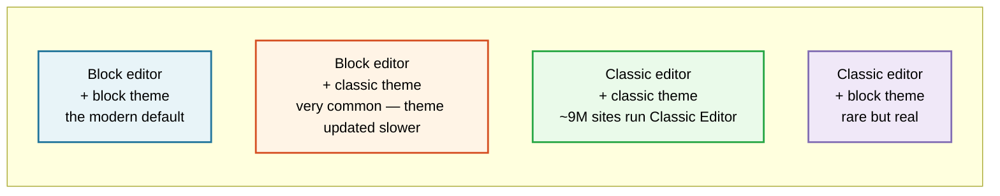

# Testing your own plugin or theme

*Get ahead of the next WordPress release instead of finding out from a support ticket.*

Written for anyone who ships a plugin or theme — one free plugin or a hundred commercial ones.
Works for any codebase; nothing here assumes a particular framework or build setup.

## What this covers

| | |
|---|---|
| [Why bother before the release](#why-bother-before-the-release) | The cost of finding out late |
| [The three acts, scaled to one plugin](#the-three-acts-scaled-to-one-plugin) | Before, during, after — for your own code |
| [The compatibility matrix](#the-compatibility-matrix) | What to actually test, and in what order |
| [Finding what will break](#finding-what-will-break-before-it-does) | Deprecations, removals, and where they're announced |
| [The "Tested up to" bump](#the-tested-up-to-bump) | What you're claiming, and what to verify before claiming it |
| [Shipping to the directory](#shipping-to-the-directory) | Guidelines, Plugin Check, and the common rejections |
| [Themes specifically](#themes-specifically) | The surfaces only themes have |
| [The release checklist](#the-release-checklist) | Copy-paste, per release |

**Go deeper:**

| | |
|---|---|
| **[Drop-in CI](ci/)** | **Start here if you do nothing else.** A supported test matrix plus a nightly canary that opens an issue when WordPress trunk breaks you |
| [Starter tests](starter-tests/) | The five PHPUnit tests and two Playwright specs that cover what a *release* breaks |
| [The release-diff method](release-diff-method.md) | Derive what your code touches, intersect it with what the release changed, prioritize by your own changelog |
| [Adopting what the release adds](adopting-new-apis.md) | The opposite question — what core now does for free that you're still hand-rolling |
| [Testing blocks](testing-blocks.md) | The highest-churn surface, where failures are invisible server-side |
| [Co-installed plugins](co-installed-plugins.md) | The seam bugs no static method can find |
| [The extender digest](extender-digest.md) | Turn a release's dev notes into a greppable list of names |
| [Accessibility](../accessibility/) | The layered method, and the accessibility-ready theme guidelines |
| [i18n and RTL](../i18n/) | Translation loading, RTL layout, and the WP 6.7 change that broke thousands of plugins |

---

## Why bother before the release

WordPress ships a major release roughly three times a year, and each one auto-updates onto a large
share of sites within weeks. If your plugin breaks on it, you find out in one of two ways:

1. You tested the beta six weeks early, fixed it quietly, and shipped an update before GA.
2. Your one-star reviews tell you, on a Saturday.

The entire difference is a few hours spent during the beta window — and most of that is setup you
only do once, then re-run each cycle.

There's a second reason that matters more than it looks. **"Tested up to" is a claim you make to
every user**, and it's the field the update screen uses to decide whether to warn people away from
your plugin. Bumping it without testing is the most common way a well-meaning author ships a
compatibility problem.

---

## The three acts, scaled to one plugin

This is the [same structure the full method uses](../README.md#a-release-party-in-three-acts), with
the scope narrowed from "all of WordPress" to "my code plus WordPress."

### Act I — before the beta drops

**Goal: know what "working" looks like before anything changes.**

You cannot tell whether a release broke your plugin if you never wrote down what it did when it
worked. That's the whole job of Act I.

1. **Get your test suite green on current stable.** If you have no tests, write the five that cover
   your plugin's actual purpose — activation, the main workflow, deactivation, uninstall, and
   whatever your support inbox complains about most. Five real tests beat a hundred aspirational
   ones.
2. **Record a manual baseline** for what tests don't cover: screenshots of your settings screen and
   main UI, a working end-to-end run of your primary feature, your admin notices in their normal
   state.
3. **Write down your support floor** — the oldest WordPress and PHP versions you claim to support.
   You're about to test against both ends.
4. **Set up one disposable site** you can reset. See
   [the environment options](../README.md#step-2-get-a-test-site); for plugin work,
   [`wp-env`](https://developer.wordpress.org/block-editor/reference-guides/packages/packages-env/)
   is usually right because it can switch WordPress and PHP versions on command.

> [!TIP]
> If your plugin has a `.wp-env.json`, add a second config for the beta so switching is one command.
> `"core": "WordPress/WordPress#master"` tracks trunk; a specific zip URL pins a build.

### Act II — when the beta drops

**Goal: does my plugin still work, and did WordPress change anything I depend on?**

Run [the compatibility matrix](#the-compatibility-matrix) below. In priority order: activation, then
your primary feature, then everything else. A plugin that fatals on activation has one bug worth
finding; a plugin that works but has a misaligned button has a bug worth finding *later*.

Turn on debugging before you start — you're hunting deprecation notices as much as failures:

```php
define( 'WP_DEBUG', true );
define( 'WP_DEBUG_LOG', true );
define( 'WP_DEBUG_DISPLAY', false );
define( 'SCRIPT_DEBUG', true );
```

Then exercise your plugin and read `wp-content/debug.log`. **Deprecation notices are your early
warning system** — they're WordPress telling you exactly what will stop working in a future release,
with the replacement named. Free bug reports from the source.

### Act III — after you've tested

**Goal: fix, ship, and bump the claim honestly.**

- Fix what broke, release an update *before* GA if you can. Users updating to the new WordPress
  should already have your compatible version.
- If something in core broke and it looks like a core bug rather than yours,
  [report it](../README.md#how-to-report-what-you-find). Plugin authors catch real core regressions
  every cycle — you're testing a combination core's own test suite doesn't have.
- [Bump "Tested up to"](#the-tested-up-to-bump) — but only if you actually tested.
- Write down what you tested. Next cycle, that list is your starting point instead of a blank page.

---

## The compatibility matrix

Test in this order. Stop and fix before moving down — a fatal on activation makes everything below
it meaningless.

| # | What | Why it's in this position |
|:--:|---|---|
| 1 | **Activate on a clean install** | A fatal here affects 100% of users instantly |
| 2 | **Activate on a site upgraded *to* the beta** | Different code path — your data is already there, and your upgrade routine runs |
| 3 | **Your primary feature, end to end** | The thing people installed you for |
| 4 | **Settings screens save and persist** | Options API and sanitization callbacks are a common breakage point |
| 5 | **`debug.log` after exercising everything** | Deprecations and notices you'd otherwise ship blind |
| 6 | **Front-end output** | Especially if you register blocks, enqueue assets, or filter content |
| 7 | **Deactivate, then reactivate** | Cleanup and re-init bugs hide here |
| 8 | **Uninstall** | Does it actually remove its data? Guideline-relevant and rarely tested |
| 9 | **Multisite** — network-activate and site-activate | Only if you support it. Say so in your readme either way |
| 10 | **Your oldest supported WP and PHP** | The bump is only safe if the floor still holds |

### The axes that multiply it

You don't need every combination — you need the ones your users actually run:

| Axis | Test at minimum |
|---|---|
| **WordPress** | Your `Requires at least`, current stable, and the Beta or RC |
| **PHP** | Your `Requires PHP` floor and the newest version WordPress supports |
| **Site mode** | Single site; plus multisite if you claim support |
| **Editor** | Block editor **and** classic (Classic Editor plugin active) — [see the four cells](#classic-and-block-four-deployments-not-one) |
| **Theme** | A block theme **and** a classic theme |
| **Other plugins** | [Your top three co-installed](co-installed-plugins.md) |
| **Accessibility** | Keyboard pass on every screen you add — [method](../accessibility/) |
| **Locale** | One non-English locale, and one RTL locale — [method](../i18n/) |

> [!IMPORTANT]
> **Your PHP floor is a real claim too.** If your readme says `Requires PHP: 7.4` and you only ever
> test on 8.3, you don't know that it's true. Syntax that works on 8.x can be a parse error on 7.4 —
> and a parse error means a white screen, not a graceful failure.

---

## Finding what will break, before it does

You don't have to guess. WordPress announces breaking changes, and there are only a few places to
look. All of these are in [the official sources register](../sources/official-sources.md).

| Source | What you'll find |
|---|---|
| [Make/Core dev notes](https://make.wordpress.org/core/tag/dev-notes/) | **The single highest-value read.** Every breaking change and new API gets a dev note before release |
| [The Field Guide](https://make.wordpress.org/core/tag/field-guide/) | One post per release collecting every dev note. Published around RC1 |
| [Make/Core](https://make.wordpress.org/core/) | Release schedule, so you know when the beta lands |
| [Developer Blog](https://developer.wordpress.org/news/) | Practical write-ups, often the clearest explanation of a change |
| Your own `debug.log` | Deprecations, with the replacement function named |

**Read the dev notes for the release you're testing, before you test.** Twenty minutes of reading
tells you which of your assumptions to check, and turns a vague "does it still work?" into a
specific list.

The changes that most often affect plugin and theme authors:

- **Deprecated or removed functions and hooks** — dev-noted, and your `debug.log` will name them
- **Changed defaults** — the function still exists but now behaves differently unless you pass an argument
- **Editor and `@wordpress/*` package changes** — if you ship blocks or extend the editor, this is your highest-risk surface
- **New or changed REST routes and capability checks** — if you use the REST API
- **Bundled library updates** — jQuery, and other libraries core ships

---

## Classic and block: four deployments, not one

WordPress is not one product. Two independent choices — **which editor** and **which theme type** —
give four combinations, and all four are real sites in large numbers.



> [!IMPORTANT]
> [**Classic Editor**](https://wordpress.org/plugins/classic-editor/) has roughly **9 million active
> installs** and is maintained by WordPress.org. That's more than almost any plugin in the directory.
> Shipping block-editor-only features without saying so leaves a large share of sites with a feature
> that silently isn't there.
>
> [Classic Widgets](https://wordpress.org/plugins/classic-widgets/) adds another ~2 million.

### Which cells you have to test

Run the inventory tool — it tells you which paradigms your code actually touches:

```bash
bash ../scripts/wp-surface-inventory.sh /path/to/your-plugin
```

```
Paradigm exposure: classic-editor files: 1 · block-editor files: 11
   → You serve BOTH. Test all four cells: {classic, block} editor × {classic, block} theme.
```

| Its verdict | What to test |
|---|---|
| **Classic surfaces only** | Both editors — confirm your features **degrade sanely** when the block editor is on, rather than vanishing without explanation |
| **Block surfaces only** | Both editors — confirm you fail *gracefully* under Classic Editor, and say so in your readme. Silence reads as "supported" |
| **Both** | All four cells. Your features differ by paradigm, so a pass in one proves nothing about the other |

### Setting up the classic lane

```bash
wp plugin install classic-editor --activate
wp option update classic-editor-replace classic     # force classic everywhere
# 'allow' lets users choose per post — test that too if you support it
```

Classic Editor has three modes, and they're different code paths: **replace** (classic only),
**allow** (user chooses, with a per-post setting), and per-user preference. If your plugin behaves
differently by editor, the *allow* mode is where you find out whether it copes with both existing
on the same site.

You can also gate in code, which many plugins do:

```php
add_filter( 'use_block_editor_for_post_type', function ( $use, $post_type ) {
    return 'my_cpt' === $post_type ? false : $use;
}, 10, 2 );
```

If you register a post type that forces one editor, **that's a feature unique to a paradigm** and
needs its own test row.

### What only exists in each

| Classic editor only | Block editor only |
|---|---|
| Meta boxes (`add_meta_box`) — the big one | Blocks and block registration |
| TinyMCE buttons and plugins (`mce_buttons`, `mce_external_plugins`) | `enqueue_block_editor_assets` |
| Quicktags / the Text tab | SlotFills, `addFilter` on editor stores |
| `wp_editor()` instances | Editor sidebar plugins |
| `media_buttons` | Block patterns and templates |
| `edit_form_after_title` and friends | Post meta via REST (needs `show_in_rest`) |
| `add_editor_style()` for the editor iframe | `theme.json` styles applied in the canvas |

> [!WARNING]
> **Meta boxes are the classic feature most often assumed to "just work."** They do render in the
> block editor — in a compatibility panel at the bottom — but they behave differently: no live
> preview, different save timing, and JavaScript written against the classic DOM will not find its
> elements. If you ship meta boxes, test them in **both** editors, and check the browser console in
> the block editor specifically.

### Classic theme vs block theme

| Classic theme only | Block theme only |
|---|---|
| `register_sidebar()` and widgets | `templates/*.html`, `parts/*.html` |
| `wp_nav_menu()` and menu locations | Navigation block |
| The Customizer | The Site Editor |
| `get_header()` / `get_footer()` / template hierarchy PHP | Block template hierarchy |
| `comments_template()` | Comment blocks |

If your plugin registers a widget, a menu location, or a Customizer section, **those surfaces do not
exist in a block theme** — the user simply won't find your feature. That's not a bug, but it is
something your readme should say, and something to test rather than assume.

## Themes specifically

Everything above applies to themes, but themes have surfaces plugins don't — and they're the ones
most likely to move in a release, because the block editor and Site Editor change fastest.

Run the inventory tool on a theme and it detects the theme-specific surfaces automatically:

```bash
bash ../scripts/wp-surface-inventory.sh /path/to/your-theme
```

```
══ THEME TYPE AND GLOBAL STYLES
  theme type       : BLOCK theme (templates/index.html present)
  theme.json       : present, schema version 2 (current is 3, WP 6.6+)
     → schema v2 is behind v3. Migrating unlocks newer settings.
  appearanceTools  : NOT enabled — one line unlocks border, link/heading/button
                     color, dimensions, sticky position, spacing, line-height
```

### The theme test matrix

| Surface | What breaks | How to check |
|---|---|---|
| **theme.json** | Schema changes, new settings you're not opting into, changed resolution order | Load the Site Editor; confirm your palette, type scale, and spacing still appear |
| **Templates** (`templates/*.html`) | Block markup invalidation, template hierarchy changes | Open each template in the Site Editor — validation errors show as "unexpected or invalid content" |
| **Template parts** (`parts/*.html`) | Same, plus part-area assignment changes | Confirm header/footer resolve and render |
| **Patterns** | Registration API changes, category changes, block markup drift | Insert every pattern you ship; check for validation errors |
| **Style variations** (`styles/*.json`) | Same schema risks as theme.json | Switch to each variation and confirm it applies |
| **`add_theme_support()`** | Deprecated in favor of theme.json | See the [superseded list](adopting-new-apis.md#addthemesupport-calls-themejson-supersedes) |
| **Template hierarchy** (classic) | Changes to which file wins | Visit each archetype: single, archive, page, search, 404 |
| **Editor styles** | Iframe changes, style scoping | Compare editor rendering against front end |
| **Block style overrides** | Core block markup or class changes | Check each core block you restyle |

### Two traps specific to themes

**Block markup validation is invisible server-side.** If a core block's saved markup changes, your
templates and patterns containing that block can throw validation errors that appear only when
someone opens the editor. Your front end may look perfect while the editor is broken. You have to
open the Site Editor and look.

**A hybrid theme has two answers.** If you ship both `templates/*.html` and classic
`single.php`-style files, the resolution between them can shift between releases. The tool flags
this when it sees both. Test which one actually wins for each route rather than assuming.

### Child themes

If your theme supports child themes, test with one active. Child theme resolution — for
`theme.json`, templates, and parts — is a distinct code path from parent-only, and it's where
inheritance bugs surface.

## The "Tested up to" bump

Your `readme.txt` header carries four fields that are promises to your users:

```
Requires at least: 6.5
Tested up to:      7.1
Requires PHP:      7.4
Stable tag:        2.4.1
```

| Field | What you're claiming |
|---|---|
| `Requires at least` | Below this WordPress version, don't install me |
| `Tested up to` | **I have actually run this against that version** |
| `Requires PHP` | Below this PHP version, don't install me |
| `Stable tag` | Which tag in the repository is the live release |

Format and validation: [Plugin Readmes handbook](https://developer.wordpress.org/plugins/wordpress-org/how-your-readme-txt-works/)
and the [readme validator](https://wordpress.org/plugins/developers/readme-validator/) — paste yours
in before every release; it catches format errors in seconds.

### Bump it only when this is true

Before you change `Tested up to`, you should be able to say yes to all of these:

- [ ] Activated on a clean install of that version — no fatals, no warnings
- [ ] Activated on a site *upgraded* to that version — the other code path
- [ ] Primary feature works end to end
- [ ] Settings save and survive a reload
- [ ] `debug.log` is clean, or every notice is understood and tracked
- [ ] Front-end output is correct on a block theme *and* a classic theme (if you touch the front end)
- [ ] Multisite checked, if you claim multisite support
- [ ] Your `Requires at least` floor still passes — bumping the ceiling doesn't excuse dropping the floor
- [ ] Your `Requires PHP` floor still parses and runs

If any box is unchecked, that's fine — just don't bump the field. An accurate lower number costs you
a "may not be compatible" notice. **An inaccurate higher number costs a user a broken site**, and it
is the difference between a plugin that's behind and a plugin that lied.

> [!TIP]
> You can bump `Tested up to` **without shipping a code change**. If your plugin works fine on the
> new release, update the readme, and commit. Users see a supported plugin; you ship nothing risky.
>
> Do this in the **RC window** rather than after GA. RC is code-frozen apart from regressions, so
> testing against RC1 is testing against what ships — and it means your users never see a
> compatibility warning at all.

---

## Shipping to the directory

If you distribute through [wordpress.org/plugins](https://wordpress.org/plugins/), everything above
sits inside a bigger set of rules.

### Run Plugin Check first

[**Plugin Check**](https://wordpress.org/plugins/plugin-check/) is the tool that catches most of what
gets plugins rejected — before a human ever looks. Install it, run it, fix what it flags.

It checks plugin headers and readme requirements, direct file access, sanitization and escaping,
nonce verification, forbidden functions, coding standards, prefixing, internationalization, asset
enqueuing, deprecated code, and accessibility.

> [!NOTE]
> **Plugin Check is not the review.** Every submission is hand-reviewed by the Plugin Review team.
> Passing the tool doesn't guarantee approval — it just means you won't be rejected for the obvious
> things, which is most rejections.

### The 18 guidelines

The [detailed plugin guidelines](https://developer.wordpress.org/plugins/wordpress-org/detailed-plugin-guidelines/)
are the actual rulebook. Read them once in full; they're shorter than they look. In summary:

1. GPL-compatible license
2. Developer responsibility for plugin contents and actions
3. A stable version must be available on the directory
4. Human-readable code — no obfuscation
5. No trialware
6. Software as a Service is permitted with conditions
7. User tracking requires consent
8. No executing code loaded from third-party systems
9. Legal, honest, and appropriate conduct
10. External links and credits require user permission
11. Don't hijack the admin dashboard
12. No readme spam
13. Use WordPress's bundled libraries
14. Don't commit excessively
15. Increment version numbers for releases
16. Submit a complete plugin
17. Respect trademarks, copyrights, and project names
18. The directory reserves the right to maintain the plugin

### What actually gets plugins rejected

The guidelines above are the rules; these are the ones people trip over in practice — and each one
maps to a guideline or a Plugin Check finding:

| Problem | The fix |
|---|---|
| Unsanitized input or unescaped output | [The security trinity](https://developer.wordpress.org/apis/security/): sanitize input, validate data, escape output |
| Missing nonce or capability checks | Every state-changing action needs both |
| Unprefixed functions, classes, or options | Prefix everything with something unique to your plugin |
| Loading code or assets from a remote server | Bundle it, or use the bundled library |
| A trademark in the plugin slug | Guideline 17 — pick a name you own |
| "Powered by" links added without asking | Guideline 10 — opt-in only |
| Untranslatable strings | Wrap in i18n functions with your text domain |
| Calling files directly without an `ABSPATH` guard | `defined( 'ABSPATH' ) || exit;` at the top of every PHP file |

The security items aren't just directory rules — they're [the same invariants](../method/security-invariants.md)
this project uses when auditing WordPress core.

---

## The release checklist

Copy this into your repo and work it each cycle.

```markdown
## WordPress <VERSION> compatibility

### Before the beta
- [ ] Test suite green on current stable
- [ ] Manual baseline recorded (screenshots + working primary feature)
- [ ] Disposable test site ready, resettable
- [ ] Read the dev notes for this release

### When the beta or RC drops
- [ ] WP_DEBUG, WP_DEBUG_LOG, SCRIPT_DEBUG on
- [ ] Activate on clean install
- [ ] Activate on upgraded site
- [ ] Primary feature end to end
- [ ] Settings save and persist
- [ ] debug.log read — deprecations triaged
- [ ] Front end on a block theme and a classic theme
- [ ] Deactivate / reactivate
- [ ] Uninstall removes its data
- [ ] Multisite (if supported)
- [ ] Oldest supported WP still passes
- [ ] Oldest supported PHP still parses and runs

### Before shipping
- [ ] Plugin Check clean
- [ ] readme validator clean
- [ ] Version number incremented
- [ ] Changelog updated
- [ ] "Tested up to" bumped — every box above checked
- [ ] Released before GA, ideally during the RC window

### If core broke something
- [ ] Searched Trac for an existing ticket
- [ ] Filed with steps to reproduce, or commented on the existing ticket
```

## Going further

Everything here is the narrow version of a broader method — the same laws, scaled down to one
codebase. If you want the full thing:

- [The main guide](../README.md) — testing WordPress releases themselves
- [Five ways your test can lie to you](../README.md#five-ways-your-test-can-lie-to-you) — all five
  apply to plugin testing, especially *"you tested a fresh install, so you learned nothing about
  upgrading"*
- [Official sources register](../sources/official-sources.md) — where authoritative answers live
- [The debugging toolkit](../README.md#the-debugging-toolkit-works-with-any-option) — Query Monitor
  first
- [The upload-content-signature bug class](upload-content-signature.md) — if your plugin calls
  `wp_upload_bits()` and hands the result to Imagick, you may have inherited the 7.0.4 RCE. A
  one-line grep tells you whether to look
- [Co-installed plugins](co-installed-plugins.md) — the seam where your compatible plugin still
  breaks beside another
