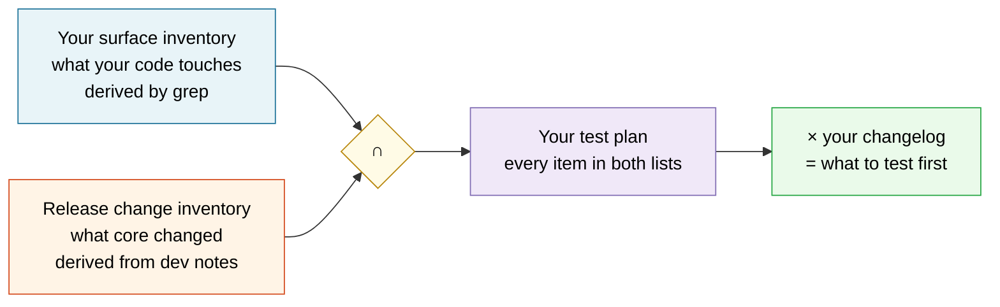

# Testing any plugin or theme against a release you haven't seen

*How to be comprehensive about a codebase whose features you don't know.*

This is the deep version of [the plugin-author guide](README.md). It answers a specific problem:
**a generic method can't know what your plugin does** — so how can it be thorough?

## The move: surfaces, not features

You cannot enumerate a plugin's features generically. Every plugin is different, and any checklist
of "test your features" degrades into "test your plugin," which is not advice.

But a plugin's exposure to a WordPress release isn't determined by its features. It's determined by
**which core surfaces it touches** — the hooks it hangs on, the functions it calls, the options it
reads, the capabilities it checks, the tables it queries. And that list is *mechanical*. You can
derive it from the code without understanding a line of the business logic.

So the method is a set intersection:



**Neither list requires knowing what your plugin is for.** That's what makes this generic *and*
comprehensive at the same time.

---

## Step 1 — derive your surface inventory

```bash
bash scripts/wp-surface-inventory.sh /path/to/your-plugin
```

It reads only; it never modifies the target. It reports every core surface your code touches,
grouped by class, sorted by how often you use it — and it auto-detects your own prefix so your own
hooks and options don't drown out core's.

```
══ CORE HOOKS CONSUMED — break if core renames, removes, or changes their arguments
  22 init
   6 save_post
   5 rest_api_init
   2 enqueue_block_editor_assets
...
══ CAPABILITIES AND ROLES — the security boundary; test as a low role, not admin
  22 manage_options
  19 edit_posts
```

Use `--csv` to pipe it into a spreadsheet and keep it cycle over cycle. **The diff between two
cycles is itself useful** — a surface you started touching since last release is a surface you've
never tested through an upgrade.

> [!TIP]
> Run it on your *dependencies* too, if you bundle any. Their surfaces are your exposure; a library
> calling a deprecated function fails in your plugin's name, not theirs.

### What the tool can't see

Be honest about the gaps, because they're where the surprises live:

| Blind spot | Why | What to do |
|---|---|---|
| **Dynamic hook names** — `add_action( "save_post_{$type}" )` | The name doesn't exist as a literal | Grep for interpolation in hook calls; list them manually |
| **Variable function calls** — `call_user_func( $fn )` | Same reason | Rare; check by hand |
| **JS runtime dependencies on core globals** | `wp.data`, `wp.blocks` at runtime | Check the browser console on the beta |
| **Behavior you rely on but never call** | Default option values, implicit ordering, the shape of a returned array | Only tests catch these |
| **Third-party plugin interactions** | Not in your code at all | Test alongside your top-3 co-installed plugins |

That last row is the big one, and no static tool solves it. A plugin can be perfectly compatible
with WordPress and still break when it runs beside another plugin the release also changed.

---

## Step 2 — build the release change inventory

Now the other half: **what did this release actually change?** Every source here is in
[the official sources register](../sources/official-sources.md).

| Source | Extract |
|---|---|
| [Field Guide](https://make.wordpress.org/core/tag/field-guide/) | **Start here.** One post per release collecting every dev note |
| [Dev notes](https://make.wordpress.org/core/tag/dev-notes/) | Each breaking change and new API, in detail |
| [Trac milestone](https://core.trac.wordpress.org/) | What shipped vs deferred — a closed ticket isn't proof |
| Your `debug.log` on the beta | Runtime deprecations, with replacements named |
| `fast-triage.sh` on the two zips | Files removed, `$_old_files` gaps, version identity |

Read each dev note and write down, in a flat list, **every name it mentions**: function names, hook
names, class names, option keys, capability strings, package names, CSS classes, REST routes. You
are not trying to understand the change yet — you're building a list of nouns to grep for.

That flat list is the whole point. It turns "read the release notes and think hard" into a
mechanical search.

> [!IMPORTANT]
> **Do this before you test, not after.** Twenty minutes of reading converts a vague "does it still
> work?" into a specific list of things to check. Testing without it means you'll only find what
> happens to be visible.

---

## Step 3 — intersect

For every name in the release inventory, search your surface inventory. Every hit is a required
test. Every miss is a documented non-exposure — which is worth recording too, because next cycle
you'll want to know you already checked.

```bash
bash scripts/wp-surface-inventory.sh ./my-plugin --csv > surfaces.csv

# then, for each name from the dev notes:
grep -i "the_content" surfaces.csv
grep -i "wp_get_attachment" surfaces.csv
```

The output has three shapes, and each means something different:

| Result | Meaning | Action |
|---|---|---|
| **Hit, high count** | Core changed something you lean on heavily | Test first, thoroughly |
| **Hit, count of 1** | One call site, easy to verify | Test, then move on |
| **No hit** | Not exposed via this surface | Record as checked. Watch for the blind spots above |

---

## Step 4 — cross-reference your own changelog

This is the step that turns a long test plan into a *prioritized* one, and it's the one almost
nobody does.

Two things independently raise risk:

- **Core changed a surface** — the release moved something under you.
- **You changed code recently** — your own code on that surface is less proven than code that's
  been stable for three years.

Where both are true, risk multiplies. Code you rewrote last month, sitting on a hook core just
changed the arguments of, is the single most likely thing to break — and it's least likely to be
covered by a test you wrote long ago.

### Getting your own change inventory

```bash
# Files you've touched since your last release tag
git diff --name-only v2.3.0..HEAD -- '*.php' '*.js'

# Which surfaces those files touch
bash scripts/wp-surface-inventory.sh ./my-plugin --csv > all-surfaces.csv
git diff --name-only v2.3.0..HEAD | grep -E '\.(php|js)$' > changed-files.txt
```

Then run the inventory script against *just* the changed files (copy them to a temp directory) and
compare. Or read your own `CHANGELOG.md` — you wrote it for exactly this.

### The risk grid

|  | **Core changed it** | **Core didn't** |
|---|---|---|
| **You changed it recently** | 🔴 **Test first.** Two moving parts, neither proven together | 🟡 Normal regression testing |
| **You didn't** | 🟠 **Test carefully.** Stable code, moved foundation — your tests may encode the old behavior | 🟢 Lowest risk. Smoke test only |

> The 🟠 cell is subtler than the 🔴 one. Long-stable code often has tests that *assert the old
> behavior*. When core changes underneath it, a passing test can mean your test is now wrong, not
> that your code is right. If a dev note says a behavior changed and your test still passes
> unchanged, go read that test.

---

## Surface by surface: what to actually check

For each class of surface, here's what a core change to it looks like and how to test it. This is
the part that stays useful regardless of what your plugin does.

### Hooks you hang on

**What changes:** a hook gets renamed or removed; its arguments change count or type; its firing
order moves; it stops firing in some context.

**Silent failure mode:** an argument is added and your callback signature still works — but you're
now ignoring information you should be using. Nothing errors.

**Test:** for each hook in your inventory that a dev note mentions, confirm your callback still
fires (log inside it), still receives what you expect (`var_dump` the args once), and still fires
in the same order relative to your other callbacks.

### Functions you call

**What changes:** deprecated, removed, return shape changed, a default parameter flipped.

**Test:** deprecations announce themselves in `debug.log` — that's the easy half. **Changed
defaults and changed return shapes do not.** For those, the dev note is your only warning, which is
why Step 2 matters.

### Capabilities and roles

**What changes:** a capability is added, split, or its mapping in `map_meta_cap()` changes.

**Test:** this is the surface where testing as an administrator tells you nothing. Use
[User Switching](https://wordpress.org/plugins/user-switching/) and exercise your plugin as every
role you claim to support — plus one role you *don't*, to confirm it's correctly denied.

> A capability check that silently starts returning `true` for a lower role is a security bug in
> your plugin caused by a change in core. You will not see it from an admin account.

### Options, meta, and transients

**What changes:** core changes a default, changes autoload behavior, or migrates a value on upgrade.

**Test:** the upgrade path specifically. Install your plugin on the *previous* WordPress, create
real data, then upgrade WordPress and confirm your data survives and is still read correctly. A
fresh install proves nothing here.

### REST routes

**What changes:** schema validation tightens, permission callbacks change, a core route you extend
moves or changes its response shape.

**Test:** call your routes directly with `wp rest` or `curl` and diff the JSON against the previous
release. Then check them as a non-admin. Schema tightening is the common one — a field core used to
accept loosely may now be rejected.

### Blocks and editor extensions

**What changes:** `@wordpress/*` package APIs, component removals and prop changes, block API
version bumps, editor DOM structure, deprecated block markup handling.

**This is the highest-churn surface in WordPress.** If you ship blocks or extend the editor, budget
more time here than everywhere else combined.

**Test:** load the editor with the browser console open — **JS errors don't reach `debug.log`, and
they're the failure mode here.** Then insert your block, save, reload, and confirm the saved markup
still validates. Block validation errors appear as "this block contains unexpected or invalid
content" and are invisible server-side.

### Enqueued assets

**What changes:** core renames a handle, unbundles a library, changes a dependency, or changes
loading strategy (defer/async).

**Test:** confirm your handles still resolve and load in the right order. A dependency that silently
stops loading gives you a JS error, not a PHP one.

### Direct database access

**What changes:** schema changes, `db_version` bumps, column type changes, new indexes.

**No deprecation warning exists for this.** If you query tables directly, you get zero notice — your
query just returns something different, or nothing. Review these by hand against the release's
schema changes every single cycle. This is the surface most likely to fail silently and most likely
to corrupt data when it does.

### Cron

**What changes:** scheduling internals, how events survive an upgrade.

**Test:** confirm your scheduled events still exist after the WordPress upgrade (`wp cron event
list`) and still fire. Cron is easy to forget because it works until it doesn't, and then it fails
invisibly for weeks.

---

## Runtime deprecation capture

Static analysis finds what you *call*. Runtime finds what actually *executes*, including inside
dependencies you didn't write. Do both.

```php
// mu-plugin on your test site — logs every deprecation with a stack trace
add_action( 'deprecated_function_run', 'x_log_dep', 10, 3 );
add_action( 'deprecated_hook_run',     'x_log_dep', 10, 3 );
add_action( 'deprecated_argument_run', 'x_log_dep', 10, 3 );
add_action( 'doing_it_wrong_run',      'x_log_dep', 10, 3 );
function x_log_dep( $thing, $replacement = '', $version = '' ) {
    error_log( sprintf(
        "[DEPRECATION] %s | replacement: %s | since: %s\n%s",
        $thing, $replacement ?: 'none', $version,
        wp_debug_backtrace_summary( null, 0, false )[3] ?? ''
    ) );
}
```

The stack trace is the point — it tells you *whose* code triggered it. Half the deprecations you
see will be a bundled library or another plugin, not you.

**Then exercise every path.** A deprecation only logs when the line runs; a code path you never
trigger during testing reports clean and breaks in production.

---

## What this method covers, and what it doesn't

Being explicit, in the spirit of the rest of this project:

**Comprehensive for:** anything reachable through a core API your code names in source — hooks,
functions, capabilities, options, meta, REST routes, blocks, assets, cron. That's the large majority
of plugin/theme breakage in any given release.

**Not covered:**

- **Interactions with other plugins.** Your top-3 co-installed plugins are worth testing alongside.
- **Behavior you depend on implicitly** but never call — default values, ordering, array shapes.
  Only tests catch these.
- **Visual and layout regressions.** Screenshot diffing is a different discipline.
- **Performance changes.** Different method entirely, and this project's
  [performance playbook](../playbooks/performance-release-audit-playbook.md) is unexercised.
- **Anything gated behind config you don't run.** If a feature only engages under specific server
  headers or browser versions, your test box may not qualify. See
  [the silent-fallback class](../skills/wordpress-audit-handoff/SKILL.md#the-silent-fallback-class--worth-its-own-habit).

Record the not-covered list in your release notes to yourself. Next cycle, "we've never tested X"
is more useful than a vague sense that testing went fine.

---

## Putting it together, per cycle

```markdown
## WP <VERSION> — compatibility pass

### Inventories
- [ ] Surface inventory regenerated: `wp-surface-inventory.sh . --csv > surfaces-<ver>.csv`
- [ ] Diffed against last cycle's — new surfaces noted
- [ ] Field Guide + dev notes read; flat list of changed names written down
- [ ] `fast-triage.sh` run on the build

### Intersection
- [ ] Every changed name grepped against surfaces.csv
- [ ] Hits listed as required tests
- [ ] Misses recorded as checked-not-exposed

### Prioritization
- [ ] `git diff --name-only <last-tag>..HEAD` — what I changed
- [ ] Risk grid filled: 🔴 cells tested first
- [ ] 🟠 cells reviewed — do my tests encode the OLD behavior?

### Execution
- [ ] Deprecation mu-plugin installed; every code path exercised
- [ ] Browser console checked on editor screens
- [ ] Tested as a non-admin role
- [ ] Upgrade path tested (previous WP → this one, with real data)
- [ ] Direct DB queries hand-reviewed against schema changes

### Close
- [ ] Core bugs filed on Trac
- [ ] "Tested up to" bumped — [the nine boxes](README.md#bump-it-only-when-this-is-true), then
      [every copy of the field](README.md#bump-every-copy--the-field-lives-in-more-than-one-place):
      Git readme, SVN trunk and stable tag, style.css for themes
- [ ] Not-covered list written down for next cycle
```

## Related

[Plugin-author guide](README.md) · [Main method](../README.md) ·
[Official sources](../sources/official-sources.md) ·
[Five ways your test can lie to you](../README.md#five-ways-your-test-can-lie-to-you)
