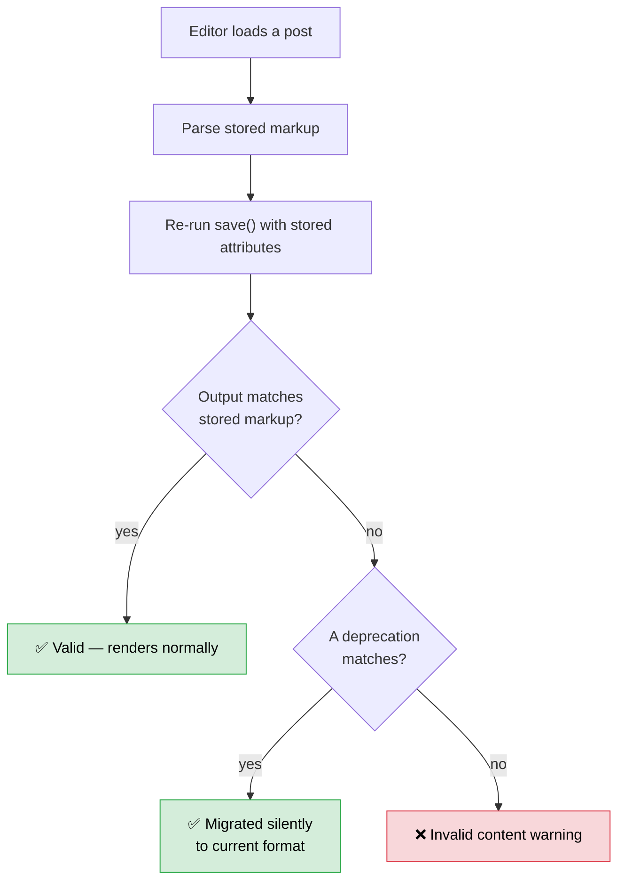

# Testing blocks across releases

*The highest-churn surface in WordPress, and the one where failures are invisible server-side.*

If you ship blocks or extend the editor, budget more time here than everywhere else combined. Two
things make blocks different from the rest of your code:

1. **Saved markup is a contract.** Every post using your block stores its HTML. Change the output and
   old posts stop validating — even though you never touched them.
2. **The failures are client-side.** Block validation runs in JavaScript, on parse. Nothing reaches
   `debug.log`. Your front end can render perfectly while every editor session shows a warning.

---

## Block validation, and why it's the main event

When the editor loads a post, it re-runs your block's `save()` against the stored attributes and
compares the result to the stored markup. If they differ by even an attribute order, the block is
**invalid**.

The user sees: *"This block contains unexpected or invalid content."* And four options — Attempt
Recovery, Convert to HTML, Convert to Classic, or Delete. Most people pick one at random.



**Deprecations are the entire safety mechanism.** A `deprecated` entry describes an older shape of
your block and how to migrate it. Without one, every change to `save()` breaks existing content.

### What triggers invalidation

| Cause | Yours or core's |
|---|---|
| You changed `save()` output | Yours — needs a deprecation |
| You renamed, added, or removed an attribute | Yours — needs a deprecation |
| You changed which block supports you declare | Yours — supports write classes and inline styles into saved markup |
| **Core changed how a support serializes** | **Core's** — and the reason to test every release |
| Core changed a parent/inner-block structure | Core's |

That fourth row is the release-testing case. You didn't change anything; core changed how `color` or
`spacing` writes into markup, and your saved posts no longer match.

### Testing it

The only reliable test is a **round trip on real content**:

1. On the **current stable** WordPress, create a post using every block you ship. Save it.
2. Upgrade WordPress to the Beta or RC.
3. Reopen that post and look.

```js
// Run in the browser console on any post — faster than clicking through.
wp.data.select( 'core/block-editor' ).getBlocks()
  .filter( b => ! b.isValid )
  .map( b => ({ name: b.name, error: b.validationIssues }) );
```

The [Playwright starter test](starter-tests/playwright/editor-block.spec.js) automates exactly this
round trip. **Save, reload, then check** — validation only runs on parse, so checking before a
reload proves nothing.

> [!IMPORTANT]
> **Keep a fixture post.** Export a WXR containing one instance of every block you ship, at every
> significant attribute combination, and import it on each new build. Hand-inserting blocks tests
> your `save()` against fresh attributes — it does not test old stored markup, which is where the
> breakage lives.

### Writing a deprecation

```js
registerBlockType( 'myplugin/card', {
    // ...current definition
    deprecated: [
        {
            attributes: { /* the OLD attribute shape */ },
            supports:   { /* the OLD supports, if they changed */ },
            save( { attributes } ) {
                // The OLD save() output, verbatim.
                return <div className="card">{ attributes.text }</div>;
            },
            migrate( attributes ) {
                // Optional: reshape old attributes into the new ones.
                return { ...attributes, content: attributes.text };
            },
        },
    ],
} );
```

Rules that bite people:

- **Order matters** — newest deprecation first. The editor tries each in order and uses the first
  that parses.
- **Never edit an old deprecation.** It describes markup that exists in the wild. Add a new one.
- **`supports` must match what was in effect** when that markup was saved, or the comparison fails
  for the wrong reason.
- **Test the deprecation itself.** A deprecation that doesn't parse is worse than none — it fails
  silently and you assume you're covered.

[Block deprecation reference](https://developer.wordpress.org/block-editor/reference-guides/block-api/block-deprecation/)

---

## The rest of the block surface

### `block.json`

The source of truth for registration. Check each release for:

- **`apiVersion`** — bumping changes how your block is rendered in the editor (iframing, wrapper
  markup). Test after any bump.
- **`supports`** — core adds keys, and default behavior can change.
- **`viewScriptModule` vs `viewScript`** — module loading is the newer path and behaves differently.
- **`$schema`** — pin it and your editor validates the file as you write:
  `"$schema": "https://schemas.wp.org/trunk/block.json"`

### Dynamic blocks and `render_callback`

Server-rendered blocks are **immune to validation errors** — there's no saved markup to mismatch.
That's a real argument for dynamic rendering when your output depends on anything that changes.

But they have their own exposure: your PHP runs on every render, so a core change to
`get_block_wrapper_attributes()`, to how supports serialize into that wrapper, or to the block
context you receive shows up as wrong markup rather than a warning.

Test dynamic blocks by **diffing rendered front-end HTML** between the old and new WordPress with the
same content.

### Block context, parents, ancestors

`providesContext` / `usesContext`, plus `parent` and `ancestor` constraints, all depend on core's
tree handling. If you rely on any of them, test your block **inside its intended parent** and not
just at the top level — that's a different code path.

### Editor extensions (filters, SlotFills, formats)

If you use `addFilter( 'blocks.registerBlockType', … )`, `editor.BlockEdit`, SlotFills, or the
rich-text format API, you're extending internals that move faster than the block API itself.

- Check the console on every editor screen — errors here are invisible everywhere else.
- Watch the [`@wordpress/*` package changelogs](https://github.com/WordPress/gutenberg/tree/trunk/packages)
  for the packages the [surface inventory](../scripts/wp-surface-inventory.sh) says you import.
- Component removals and prop changes are the usual breakage. Dev notes call them out.

### Accessibility in the editor

Block and editor accessibility regressions concentrate here, because custom controls replace native
ones. Every custom control you add to the block inspector or toolbar is a keyboard claim.

- **Can every inspector control be reached and operated by keyboard?** Sidebar panels, toolbar
  buttons, and popovers all need to work without a mouse.
- **Does your block announce itself?** Blocks need accessible names; a block that announces as
  "Block" tells a screen-reader user nothing.
- **Does focus return sensibly** after a popover or modal closes?
- **Is your block usable at 200% zoom** in the editor canvas, not just on the front end?

Core ships `@wordpress/a11y` — use `speak()` for status messages rather than inventing your own live
region. See [the accessibility method](../accessibility/) and
[the keyboard procedure](https://wpaccessibility.org/docs/testing/keyboard/).

### Patterns and templates

Patterns are just block markup, so they inherit every validation risk above — **and nobody opens
them until a user inserts one.** Insert every pattern you ship on each new build.

For themes, the same applies to `templates/*.html` and `parts/*.html`. Open each in the Site Editor.

---

## The per-release block checklist

```markdown
## Blocks — WP <VERSION>

### Fixtures
- [ ] Fixture WXR imported (every block, every significant attribute combination)
- [ ] Created on the PREVIOUS release, opened on this one

### Validation
- [ ] Every block still valid after save → reload (console query or Playwright)
- [ ] Every pattern inserted without a validation warning
- [ ] Templates and parts opened in the Site Editor (themes)
- [ ] Deprecations still parse — old markup migrates rather than warning

### Registration
- [ ] block.json apiVersion reviewed against the dev notes
- [ ] supports still produce the controls you expect
- [ ] Tested against a theme WITH appearanceTools and one WITHOUT
- [ ] viewScriptModule / viewScript still loads

### Runtime
- [ ] Zero console errors on post editor and Site Editor
- [ ] Dynamic block front-end HTML diffed against the previous release
- [ ] Block tested inside its intended parent, not only standalone
- [ ] Editor extensions (filters, SlotFills, formats) still apply
```

## Related

[Plugin & theme guide](README.md) · [Release-diff method](release-diff-method.md) ·
[Adopting new APIs](adopting-new-apis.md) · [Starter tests](starter-tests/) ·
[Block Editor Handbook](https://developer.wordpress.org/block-editor/)
